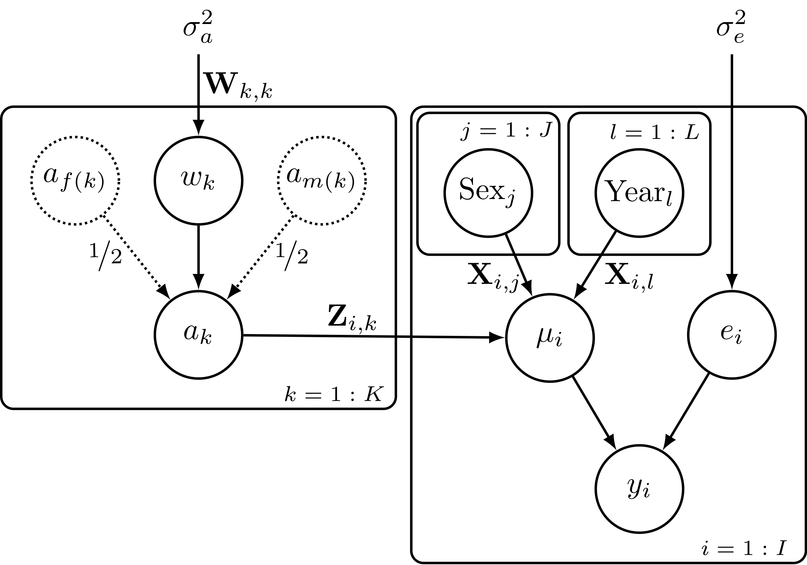

<style>
  .col2 {
    columns: 2 200px;         /* number of columns and width in pixels*/
    -webkit-columns: 2 200px; /* chrome, safari */
    -moz-columns: 2 200px;    /* firefox */
  }
  .col3 {
    columns: 3 100px;
    -webkit-columns: 3 100px;
    -moz-columns: 3 100px;
  }
  .text {
    text-align: justify;
    text-justify: inter-word;
  }
</style>


```{r setup, include=FALSE}
knitr::opts_chunk$set(echo = TRUE, message = FALSE, error=FALSE, warning = FALSE,
                      fig.align = "center", fig.height = 6, fig.width = 6,
                      class.source = "lineAnchors")
```

<div class="text">
All our algorithms and analysis was built using a stable version 4.3.0 of JAGS, stable version 0.10.1 of NIMBLE, and `R` version 3.6.3. We are also using the packages `rjags` [@denwoodRunjagsPackageProviding2016a] and `nimble` [@devalpineNIMBLEMCMCParticle2020], to build models, `coda` [@CODA] and `MCMCvis` [@youngfleshMCMCvisToolsVisualize2018] to extract summary information from MCMC output; `AlphaSimR` [@gaynorAlphaSimRRpackageBreeding2020] to make animal breeding programme simulation; `MatrixModels`[@batesMatrixModelsModellingSparse2015]; and `pedigreemm`[@batesPedigreemmPedigreebasedMixedeffects2014]; `ggplot2` [@wickhamGgplot2ElegantGraphics2016], `patchwork` [@pedersenPatchworkComposerPlots2020], and `ggrepel` [@slowikowskiGgrepelAutomaticallyPosition2020] to prepare graphical outputs; `dplyr` [@wickhamDplyrGrammarData2020], `knitr` [@xieKnitrGeneralPurposePackage2020], `kableExtra`[@zhuKableExtraConstructComplex2020], and `formattable` [@renFormattableCreateFormattable2016] for general purposes. 
</div>

```{r}
sessionInfo()
```

```{r, include=FALSE, message=FALSE, error=FALSE, warning=FALSE}
#=======================================================================
# Packages
#=======================================================================
if (!require("pacman")) {
  install.packages("pacman")
}
pacman::p_load(
  knitr,
  runjags,
  MCMCvis,
  coda,
  ggrepel,
  dplyr,
  kableExtra,
  MatrixModels,
  pedigreemm,
  prettycode,
  formattable,
  AlphaSimR,
  patchwork
)

if (!require("animalModels")) {
  install.packages("./R/animalModels_0.0.1.tar.gz", repos = NULL,
                   type="source")
}
library(animalModels)
prettycode::prettycode() 
#=======================================================================
## Functions
#=======================================================================
file.sources <- list.files(path="./R/", pattern = "*.R")
file.sources <- paste0("./R/",file.sources)

sapply(file.sources, source, .GlobalEnv)
```

# Brief description of animal model
<div class="text">
Animal models have been used to gain some knowledge about genetic and environmental parameters, and generally, the phenotype values are a function of fixed and random effects. This approach is so-called mixed-effects models and has been used for many decades in different research fields. However, the random effects and their associated variance components have a special meaning when working in the genetics field, and avoiding complexity will gently explain those ideas and interpretation. Suppose a straightforward experiment where we measured response variable $y_{i}$, called phenotype, on the $i$th individual. Some of them have one or both parents (un)known, and some animals belong to a group factor with two levels (1 or 2), as we show in the following database:
</div>

<a id="example1"></a>
```{r, echo=FALSE}
#=======================================================================
# Dataset
#=======================================================================
example <- data.frame(
  individual = c(  1,   2,   3,   4,   5,   6,   7,   8,   9),
  father = c( NA,  NA,   2,   2,   4,   2,   5,  NA,   7),
  mother = c( NA,  NA,   1,  NA,   3,   3,   6,  NA,   8),
  phenotype = c( NA, 105,  98, 101, 106,  93,  NA,  NA, 109),
  group = c( NA,   1,   1,   2,   2,   2,  NA,  NA,   1)
)
example$group <- as.factor(example$group)
```

```{r example, echo=FALSE}
example %>%
  kable(
    caption = "Example data set for animal model",
    format = "html",
    label = "example",
    booktabs=TRUE,
    digits = 4,
  ) %>%
  kable_paper("hover", full_width = F)
```
<div class="text">
The simplest way to capture the expected relationship between $y_i$ and some covariates is through the model:
</div>

<a id="model"></a>
\begin{align}
\begin{array}{c}
         y_{ij} = b_{j} + a_{i} + e_{ij}, \\
         b_{j} = m + Gr_{j}, \quad a_{i} \sim \mbox{N}\left(0, \sigma_{a}^{2}\right), \quad e_{ij} \sim \mbox{N}\left(0,\sigma^2_{e}\right)
\end{array}
\label{eq:basic_model}
\end{align}
<div class="text">
where $y_{ij}$ is the phenotypic value of individual $i$ from group $j$, $b_{j}$ is the mean for the group $j$, $a_{i}$ is an additive genetic value of individual $i$ (frequently
called breeding value), $m$ is the overall mean, $Gr_j$ is the effect of $j$th group, and $e_{ij}$ is the (experimental) error term. This model can be easily extended to account for a more complex experiment, and it can be generalized through matrix notation as:
</div>
\begin{eqnarray}
\mathbf{y} & = & \mathbf{X}\mathbf{b}+\mathbf{Z}\mathbf{a}+\mathbf{e},\label{eq:animal_model}
\end{eqnarray}
<div class="text">
where design matrices ($\mathbf{X}$ and $\mathbf{Z}$) link the unknown parameters $\mathbf{b}$ and predicted values at population-level $\mathbf{a}$ with phenotypic values $(\mathbf{y})$. Standard assumptions for phenotypes following normal (Gaussian) distribution are $\mathbf{e}|\sigma_{e}^{2} \sim \mbox{N}\left(\mathbf{0},\sigma_{e}^{2}\mathbf{I}\right)$, $\mathbf{y}|\mathbf{a} \sim \mbox{N}\left(\mathbf{X}\mathbf{b}+\mathbf{Z}\mathbf{a}, \sigma_{e}^{2}\mathbf{\mathbf{I}}\right)$, and marginally $\mathbf{y} \sim \mbox{N}\left(\mathbf{X}\mathbf{b}, \mathbf{Z}\mathbf{G}\mathbf{Z}^{T}+\sigma_{e}^{2}\mathbf{\mathbf{I}}\right)$, where $\mathbf{G}$ represents a general variance-covariance matrix for $\mathbf{a}$. For now, let us assume $\mathbf{G} = \sigma_{a}^{2}\mathbf{A}$, where $\mathbf{A}$ is a numerator relationship matrix (NRM) used to account for the additive genetic covariance between records of related animals, and $\sigma_{a}^{2}$ is the additive genetic variance. Consequently, $\mathbf{a}|\mathbf{A},\sigma_{a}^{2} \sim  \mbox{N}\left(\mathbf{0},\mathbf{A}\sigma_{a}^{2}\right)$. In addition, matrix $\mathbf{A}$ can be decomposed as $\mathbf{T}\mathbf{W}\mathbf{T}^{T}$, where $\mathbf{T}$ is a dense unit lower triangular matrix describing the flow (trace) of genes in the pedigree; $\mathbf{W}$ is a diagonal matrix with values depending on the knowledge of parents and parent inbreeding coefficients.

Before we begin the specification of this model in `R`, let us check how the design matrices $\mathbf{X}$ and $\mathbf{Z}$, and matrices $\mathbf{A}$, $\mathbf{T}$, and $\mathbf{W}$ should be specified based on our [`example`](#example1):

* Matrix $\mathbf{X}$ associated with fixed effects: 
</div>

```{r X_matrix}
(X <- model.Matrix(~ group, data=example))
```
* Matrix $\mathbf{Z}$ associated with random effects: 

```{r}
Ind <- as.factor(example$individual)
(Z <- model.Matrix(~ Ind - 1, data = example, sparse=TRUE))
```

* Matrix $\mathbf{A}$:

```{r, include=FALSE}
## Inverse additive relationship matrix (A)
pedigree1 <- pedigreemm::pedigree(sire=example$father, dam=example$mother, 
                      label=example$individual)

## Inverse of the dense unit lower triangular matrix
(TInv <- as(pedigree1, "sparseMatrix"))

Tm <- solve(TInv)

## vector of the diagonal for the D matrix from the decomposition A= TWT'
## D is the variance and covariance matrix for Mendelian sampling
## This function returns a numeric vector with the entries of W
WInv <- Matrix::Diagonal(x=1/pedigreemm::Dmat(pedigree1))

Wm <- solve(WInv)
## Within family segregation variance coefficients 
diag(solve(WInv))

## Inverse of the pedigree matrix A^-1 = T^-1 %*% W^1/2 %*% W^1/2 %*% t(T^-1)
(AInv <- crossprod(sqrt(WInv) %*% TInv))

A <- solve(AInv)
```

```{r}
MASS::fractions(as.matrix(A))
```

* Matrix $\mathbf{T}$ (lower triangular matrix):

```{r}
Tm
```


* $\mathbf{W}$ (the variance and covariance matrix for Mendelian sampling):
```{r}
(MASS::fractions(as.matrix(Wm)))
```

* Vector of the diagonal for matrix $\mathbf{W}^{-1}$:

```{r}
diag(WInv <- Diagonal(x=1/Dmat(pedigree1)))
```

# BUGS language and JAGS implementation

<div class="text">
BUGS users do not need to know how to construct the full conditional distributions and choose sampling algorithms. Users have to supply model, data, and possibly some initial values, while the BUGS program itself does the rest. The key part and difference to other programs is the model description. BUGS model language is described in 
[@spiegelhalter_winbugs_2003; @spiegelhalter_openbugs_2007]. Here, the two most important operators are described, namely `~` and `<-`:

* Operator (`~`) describes the stochastic relationship, e.g., `a ~ dnorm(mu, tau)` states that variable a is distributed according to the normal distribution with specified mean and variance. 
* Operator (`<-`) describes the deterministic relationship, e.g., `mu <- a + b` states that variable `mu` is a sum of two components. 

Finally, everything that follows the character `#` is considered a comment and is not evaluated by BUGS or JAGS packages.

The animal model code proposed here is a direct description of DAG using BUGS language. The code below is similar to the one presented by @waldmann_easy_2009, but it is more compact and generic. 
</div>

<a id="animalmodel"></a>
```{r,  results=FALSE, class.source = "numberLines lineAnchors"}
# Animal model in BUGS language
AnimalModelBUGSVar <- function()
{
  ## Priors - precision parameters
  tau2e ~ dgamma(0.001, 0.001)
  tau2a ~ dgamma(0.001, 0.001)
  sigma2e <- pow(tau2e, -1)
  sigma2a <- pow(tau2a, -1)

  ## Additive genetic values
  for(k in 1:nI) {
    a[id[k]] ~ dnorm(pa[id[k]], Xtau2a[id[k]])
    pa[id[k]] <- 0.5 * (a[fid[k]] + a[mid[k]])
    Xtau2a[id[k]] <- winv[id[k]] * tau2a
  }
  a[nU] <- 0 # NULL (zero) holder

  ## Fixed Effects
  for(j in 1:nB) { b[j] ~ dnorm(0, 1.0E-6) }

  ## Phenotypes
  for(i in 1:nY) {
    y[i] ~ dnorm(mu[i], tau2e)
    mu[i] <- inprod(x[i, ], b[]) + a[idy[i]]
  }
}
```

<div class="text">
Waldmanns' proposal treats founders and non-founders separately, assumes that phenotypic data is available only for non-founders, neglects the inbreeding when calculating the coefficients of within-family segregation variance is not easy to extend. There are no such limitations in `AnimalModelBUGSVar`.

Required data for the proposed implementation is symbolically shown bellow: 
</div>
```{r}
tmp <- AnimalModelBUGSData(ped=example, intercept = FALSE)

# Pedigree 'Plate'
list(nI = tmp$nI, id = tmp$id, fid = tmp$fid, mid = tmp$mid,
     winv = tmp$winv, nU = tmp$nU)
```

```{r}
# Phenotype 'plate'
list(nY = tmp$nY, idy = tmp$idy, y = tmp$y, nB = tmp$nB, x = tmp$x)
```

```{r}
# Variance
sigma2a <- 1/3
sigma2e <- 1

# Precision = 1 / variance
tmp$tau2a <- 1 / sigma2a
tmp$tau2e <- 1 / sigma2e
```

<div class="text">
The length of variables differs, but this can be accommodated using the list structure described in the JAGS manual. Users have to provide pedigree in the form of three integer identification vectors which constitute family trios (`id` - individual, `fid` - father, and `mid` - mother). Additionally, a vector `winv` with the coefficients of within family segregation variance coefficients is required. The length of these vectors is $nI\times1$, where $nI$ is the number of all individuals in the pedigree. Identifications need not range between $1$ and $nI$, though this is commonly done. Even character names can be used for identifications in JAGS, but several other programs often rely on pedigree members' integer coding. 

All unknown parents must be presented with the identification number $nU$, commonly $nU=nI+1$. This corresponds to an additional dummy node (`a[nU]`) in the DAG. The addition of a dummy node enables the use of the same code for founders and non-founders and is mandatory because BUGS/JAGS does not allow 'zero indexing' (e.g. `a[0]`) as has been suggested by @damgaard_technical_2007. Variables regarding the phenotypes are: 

* the number of phenotypic records (`nY`), individual identifications (`idy`) which link phenotypes and pedigree as sketched by $\mathbf{Z}_{i,k}$ arc.
* phenotypic values (`y`)
* model predictor(s) (`x`), which can be either a factor or covariate, and
* the number of fixed effects (`nB`). 

For JAGS, data (phenotypes, pedigree, and identifications) need not be sorted in chronological or any other order. However, other programs that work with pedigree data often rely on different ways of ordering the
data.

Records with missing phenotypes are excluded, except for the pedigree part. However, JAGS has a notable feature regarding missing values. When the phenotype is missing, but other variables are not, then such a record can be added to the data (phenotype must be set to `NA`, and JAGS will automatically impute randomly generated value given the specified model. This feature can be used to create simulated data according to an animal model (e.g. @van_vleck_algorithms_1994).
Given the pedigree, model description, and a full vector of missing phenotypic values (all set to `NA`), JAGS will forward the sample from the specified distributions from the top to the bottom of DAG, which will at the end produce a sample of phenotypic values. For the simulation, it is recommended to use the informative priors or preset values for some parameters to get moderate phenotypic values. Finally, if variances are assumed known, their values need
to be added in the data (Table \@ref(tab:example)) and their prior specifications in the model must be removed ([see AnimalModelBUGSVar](#animalmodel)).

Because JAGS does not allow the specification of improper distributions, developers suggested the use of conditionally conjugate gamma distribution for $\tau^{2}$ (`tau2`) with small values for both parameters, $p\left(\tau^{2}\right)\sim Gamma\left(0.001,0.001\right)$. This is equivalent to $p\left(\sigma^{2}\right)\sim Inverse-Gamma\left(0.001,0.001\right)$. @waldmann_easy_2009 used the uniform priors for standard deviations ($\sigma_{a}$ and $\sigma_{e}$) following the suggestion of @gelman_prior_2006, who demonstrated that this prior seems to be more non-informative for the models with a small number of groups (individuals) or a small between-group variance. The latter scenario should be of concern for quantitative geneticists analysing traits with small genetic variability. Variance priors in [AnimalModelBUGSVar](#animalmodel) use a conditionally conjugate gamma distribution so that BUGS/JAGS can use Gibbs sampling instead of other more time-consuming algorithms. However, this does not mean that gamma prior for precisions should be preferred to the uniform prior for standard deviations. Users are encouraged to perform sensitivity analysis with different priors and decide if priors affect their conclusions. Following the approach described here, users familiar with JAGS can easily conduct such analyses by changing a line or two in [AnimalModelBUGSVar](#animalmodel).
</div>

# Animal models accounting or not for inbreeding

## Example 2: Animal model ignoring inbreeding


```{r}
# General JAGs definitions
#-----------------------------------------------------------------------
# Initialization
#-----------------------------------------------------------------------
initfunction <- function(chain) {
  nI <- 9
  nB <- 2
  nc <- 3
  stopifnot(chain %in% 1:nc)
  a <- b <- list()
  for(i in 1:nc){
    a[[i]] <- c(rnorm(nI,0,2),NA)
    b[[i]] <- rnorm(nB,100,10)
  }
  .RNG.name <- rep("base::Super-Duper", 3)[chain]
  .RNG.seed = seq(1,3,1)[chain]
  return(list(a = a[[chain]], b = b[[chain]], 
              .RNG.seed = .RNG.seed, .RNG.name = .RNG.name))
}

## runJags
nChains <- 3
nBurninSteps <- 30000
nThinSteps <- 15
nUseSteps <- 60000

# Number of fitted models to calculating computing cost 
nt <- 50
```

```{r}
#-----------------------------------------------------------------------
## For repeatability model
#-----------------------------------------------------------------------    
## Hyperparameters - variance of additive genetic values and variance of
## residuals
sigma2a <- 1/3
sigma2e <- 1

# Heritability
(h2 <- sigma2a / (sigma2a + sigma2e)) ## 0.25
```

```{r}
#=======================================================================
# Animal Model ignoring inbreeding
#=======================================================================
## Prepair data - ignoring inbreeding 
tmp <- AnimalModelBUGSData(ped=example,  inbreeding = FALSE,
                            intercept = FALSE)

## Set precisions
tmp$tau2a <- 1 / sigma2a
tmp$tau2e <- 1 / sigma2e
tmp
```

### JAGs model

```{r,  results=FALSE, class.source = "numberLines lineAnchors"}
AnimalModelBUGS <- function()
{
  ## Additive genetic values
  for(k in 1:nI) {
    a[id[k]] ~ dnorm(pa[id[k]], Xtau2a[id[k]])
    pa[id[k]] <- 0.5 * (a[fid[k]] + a[mid[k]])
    Xtau2a[id[k]] <- winv[id[k]] * tau2a
  }
  a[nU] <- 0 # NULL (zero) holder

  ## Location priors
  for(j in 1:nB) { b[j] ~ dnorm(0, 1.0E-6) }

  ## Phenotypes
  for(i in 1:nY) {
    y[i] ~ dnorm(mu[i], tau2e)
    mu[i] <- inprod(x[i, ], b[]) + a[idy[i]]
  }
}
```

**Some comments:**

* `x[i, ]` is the $i$th line of matrix $\mathbf{X}$;
* `b[]` is the vector of fixed effects;
* `a[id[k]]` is the additive genetic ($a_{i} \sim \mbox{N}\left(0, \sigma_{a}^{2}\right)$);
* `pa[id[k]]` is the expected value based on parents additive genetic ($1/2\left(a_{father(i)}+ a_{mother(i)}\right)$);
* `winv[id[k]]` is the within family segregation variance coefficients;
* `tau2a` is the precision parameter, which is the reciprocal of the genetic variance ($\sigma^2_{a}=1/\tau^2_a$);
* `tau2e` is the precision parameter for the experimental error;

```{r}
## Writing the JAGS model
filename <- "model.txt"
writeJags(model = AnimalModelBUGS, filename = filename)
#-----------------------------------------------------------------------
# Jags
#-----------------------------------------------------------------------
## runJags
jags_params <- c("a", "b")
runJagsOut <- run.jags(method = "parallel",
                       model = filename,
                       monitor = jags_params,
                       data = tmp,
                       n.chains = nChains,
                       burnin = nBurninSteps,
                       sample = ceiling(nUseSteps/nChains),
                       thin = nThinSteps,
                       summarise = FALSE,
                       plots = FALSE,
                       inits = initfunction)

# coda samples - MCMC
coda_samples <- as.mcmc.list(runJagsOut)

# parameter estimates
estimatesNoInbreeding <- MCMCsummary(coda_samples, round = 4)
estimatesNoInbreeding
```

```{r, include=FALSE, eval=FALSE}
# Measuring the time spended to run the model
time_NoInbreeding <- NA
for(i in 1:nt){
  start_time <- Sys.time()
  r1 <- run.jags(method = "parallel",
                 model = filename,
                 monitor = jags_params,
                 data = tmp,
                 n.chains = nChains,
                 burnin = nBurninSteps,
                 sample = ceiling(nUseSteps/nChains),
                 thin = nThinSteps,
                 summarise = FALSE,
                 plots = FALSE,
                 inits = initfunction)
  end_time <- Sys.time()
  time_NoInbreeding[i] <- difftime(end_time, start_time, units='secs') 
}
time_NoInbreeding_mean <- mean(time_NoInbreeding)
time_NoInbreeding_se <- sd(time_NoInbreeding)/sqrt(nt)
save(time_NoInbreeding, time_NoInbreeding_mean, time_NoInbreeding_se,
     file = "./Results/Small_Example/time_NoInbreeding.RData")
```


```{r, include=FALSE}
#-----------------------------------------------------------------------
# Posterior
#-----------------------------------------------------------------------
posterior <- as.matrix(coda_samples)

#-----------------------------------------------------------------------
# General Diagnostic
#-----------------------------------------------------------------------
# parameter a
# mcmc_areas(posterior[, 1:9],  prob = 0.95)

# Parameter b
# mcmc_areas(posterior[, 11:12],  prob = 0.95)

# trace plot
# mcmc_trace(posterior)

# Autocorrelation
# autocorr.plot(posterior)

# Gelman-Rubin convergence diagnostic
gelman.diag(coda_samples[, c(1:9, 11:12)])
```

## Example 2: Animal model accounting for inbreeding

```{r}
## Prepair data
tmp <- AnimalModelBUGSData(ped=example, intercept = FALSE)

## Set precisions
tmp$tau2a <- 1 / sigma2a
tmp$tau2e <- 1 / sigma2e

tmp
```

```{r,  results=FALSE, class.source = "numberLines lineAnchors"}
#=======================================================================
##  Animal model known variance
#=======================================================================
AnimalModelBUGS <- function()
{
  ## Additive genetic values
  for(k in 1:nI) {
    a[id[k]] ~ dnorm(pa[id[k]], Xtau2a[id[k]])
    pa[id[k]] <- 0.5 * (a[fid[k]] + a[mid[k]])
    Xtau2a[id[k]] <- winv[id[k]] * tau2a
  }
  a[nU] <- 0 # NULL (zero) holder

  ## Location priors
  for(j in 1:nB) { b[j] ~ dnorm(0, 1.0E-6) }

  ## Phenotypes
  for(i in 1:nY) {
    y[i] ~ dnorm(mu[i], tau2e)
    mu[i] <- inprod(x[i, ], b[]) + a[idy[i]]
  }
}
```

### JAGs model

```{r, results=FALSE}
## Structuring the dataset
tmp <- AnimalModelBUGSData(ped=example, intercept = FALSE)

## Set precisions
tmp$tau2a <- 1 / sigma2a
tmp$tau2e <- 1 / sigma2e

print(tmp)

## Writing the JAGS model
filename <- "model.txt"
writeJags(model = AnimalModelBUGS, filename = filename)
#=======================================================================
# Jags
#=======================================================================
jags_params <- c("a", "b")
runJagsOut <- run.jags(method = "parallel",
                       model = filename,
                       monitor = jags_params,
                       data = tmp,
                       n.chains = nChains,
                       burnin = nBurninSteps,
                       sample = ceiling(nUseSteps/nChains),
                       thin = nThinSteps,
                       summarise = FALSE,
                       plots = FALSE,
                        inits = initfunction)
# coda samples - MCMC
coda_samples <- as.mcmc.list(runJagsOut)
```

```{r, include=FALSE, eval=FALSE}
# Measuring the time spended to run the model
time_Inbreeding <- NA
for(i in 1:nt){
  start_time <- Sys.time()
  r1 <- run.jags(method = "parallel",
                 model = filename,
                 monitor = jags_params,
                 data = tmp,
                 n.chains = nChains,
                 burnin = nBurninSteps,
                 sample = ceiling(nUseSteps/nChains),
                 thin = nThinSteps,
                 summarise = FALSE,
                 plots = FALSE,
                 inits = initfunction)
  end_time <- Sys.time()
  time_Inbreeding[i] <- difftime(end_time, start_time, units='secs') 
}
time_Inbreeding_mean <- mean(time_Inbreeding)
time_Inbreeding_se <- sd(time_Inbreeding)/sqrt(nt)
save(time_Inbreeding, time_Inbreeding_mean, time_Inbreeding_se,
     file = "./Results/Small_Example/time_Inbreeding.RData")
```

### Parameter estimates
```{r}
# Estimates
estimatesInbreeding <- MCMCsummary(coda_samples, round = 4)
estimatesInbreeding
```

```{r, include=FALSE}
#-----------------------------------------------------------------------
# Posterior
#-----------------------------------------------------------------------
posterior <- as.matrix(coda_samples)

#-----------------------------------------------------------------------
# General Diagnostic
#-----------------------------------------------------------------------
# parameter a
# mcmc_areas(posterior[, 1:9],  prob = 0.95)

# Parameter b
# mcmc_areas(posterior[, 11:12],  prob = 0.95)

# trace plot
# mcmc_trace(posterior)

# Autocorrelation
# autocorr.plot(posterior)

# Gelman-Rubin convergence diagnostic
gelman.diag(coda_samples[, c(1:9, 11:12)])
```

## Camparing both animal models (with and without inbreeding)

<div class="text">
@waldmann_easy_2009 following @lin_monte_1999 did not account for inbreeding in the calculation of within family segregation (Mendelian) variance coefficients $\left(\mathbf{W}\right)$; they both used value 0.5 for all non-base individuals. The effect of neglecting inbreeding on the inference of $\mathbf{b}$ and $\mathbf{a}$ for model ([Animal Model](#model)) and the example data set (Table \@ref(tab:example)) is not large, but is observable (Table \@ref(tab:compNoInb) and Figure \@ref(fig:plotNoInb)). Some general-purpose animal model programs do not account for inbreeding by default. The amount of inbreeding is often rather low, and the computation of inbreeding coefficients might be difficult for large populations. However, this is not optimal for each scenario. 
</div>

```{r}
#-----------------------------------------------------------------------

#-----------------------------------------------------------------------
data_comp <- data.frame(NoInb = estimatesNoInbreeding[c(1:9), 1],
                        Inb = estimatesInbreeding[c(1:9), 1],
                        Animal = gl(n = 9,  k = 1,
                                    labels = paste0("Animal ", 1:9)))
```

```{r plotNoInb, fig.cap= "A"}
data_comp %>%
  ggplot(aes(y = NoInb,  x = Inb,  label = Animal)) +
  geom_point(shape = 1,  alpha = 0.9) +
  geom_abline(intercept = 0,  slope = 1) +
  geom_text_repel(
    nudge_y      = 0.05,
    direction    = "x",
    vjust        = 0,
    segment.size = 0.2) +
  ylab("Estimates considering no inbreeding") +
  xlab("Estimates considering inbreeding") +
  theme_bw(base_size = 12)
```

```{r}
data_diff <- data.frame(
  Parameter = rownames(estimatesInbreeding)[c(1:9, 11:12)],
  Difference = estimatesNoInbreeding[c(1:9,  11, 12), 1] -
               estimatesInbreeding[c(1:9,  11, 12), 1],
  Ratio = estimatesNoInbreeding[c(1:9,  11, 12), 1]/
          estimatesInbreeding[c(1:9,  11, 12), 1])
```

```{r compNoInb, echo=FALSE}
data_diff %>%
  kbl(
    caption = "Difference and ratio between parameter estimates",
    digits = 4,
  ) %>%
  kable_paper("hover", full_width = F) %>%
  column_spec(2, color = "white",
              background = spec_color(data_diff[,2], end = 0.7),
              popover = paste("am:", data_diff[,2])) %>%
  column_spec(3, color = "white", 
              background = spec_color(data_diff[,2], end = 0.7),
              popover = paste("am:", data_diff[,3]))
```
<div class="text">
@mehrabani-yeganeh_including_2001 simulated populations, where animals were selected based on the additive genetic values computed with or without accounting for inbreeding. Simulation ignored the potential variation due to dominance and, therefore, inbreeding depression. They concluded that missing inbreeding did not affect animals' ranking and consecutively affected response to selection even with high inbreeding levels. However, ignoring inbreeding results in underestimating additive genetic variance in the base population due to overestimated family segregation coefficients in non-base individuals. Additionally, when inbreeding is accounted for, the animal model, coupled with McMC methods, can infer the change of additive genetic variance over generations due to the Bulmer effect [@sorensen_inferring_2001]. The applicability of this method for evolutionary studies still needs to be assessed. Thus, it is better to account for inbreeding if possible.
</div>

# Cholesky decomposition of relationship matrix

<div class="text">
Matrix $\mathbf{A}$ can also be decomposed via the Cholesky method,
$\mathbf{A}=\mathbf{T}\mathbf{W}^{\frac{1}{2}}\mathbf{W}^{\frac{1}{2}}\mathbf{T}^{T}=\mathbf{L}\mathbf{L}^{T}$, which is  useful for efficient numerical solutions as well as for Monte Carlo simulations. The diagonal values of $\mathbf{W}$ are computed according to the following three formulas \@ref(eq:MS) which correspond to scenarios (from top to bottom): both parents known, one parent known (say mother), and both parents unknown:

\begin{align}
\mathbf{W}_{i,i} & = & 1-\frac{1}{4}\left(1+F_{f\left(i\right)}\right)-\frac{1}{4}\left(1+F_{m\left(i\right)}\right)=\frac{1}{2}-\frac{1}{4}\left(F_{f\left(i\right)}+F_{m\left(i\right)}\right), (\#eq:MS) \\
\mathbf{W}_{i,i} & = & 1-\frac{1}{4}\left(1+F_{m\left(i\right)}\right)=\frac{3}{4}-\frac{1}{4}F_{m\left(i\right)},\nonumber \\
\mathbf{W}_{i,i} & = & 1.\nonumber 
\end{align}
In the case of ignoring inbreeding or no inbreeding, the formulas give values: $\frac{1}{2}$, $\frac{3}{4}$, and $1$.


@waldmann_easy_2009 reported that his implementation is faster and results in Markov chains with better mixing (smaller autocorrelations) in comparison to @damgaard_technical_2007. The code proposed by @waldmann_easy_2009 first computes the parent average and precision (1 / variance) to sample from the normal distribution with these two parameters ([see Variant 1](#variant1)).
</div>

<a id="variant1"></a>
```{r, results=FALSE, class.source = "numberLines lineAnchors"}
## Transformed additive genetic values - variant 1
AnimalModelBUGSCholVar <- function()
{
  ## Variance priors
  tau2e ~ dgamma(0.001, 0.001)
  tau2a ~ dgamma(0.001, 0.001)
  sigma2e <- 1 / tau2e
  sigma2a <- 1 / tau2a

  ## Additive genetic values
  for(k in 1:nI) {
    u[k] ~ dnorm(0, tau2a)
    a[id[k]] <- u[k] * wsqr[id[k]] + 0.5 * (a[fid[k]] + a[mid[k]])
  }
  a[nU] <- 0 # NULL (zero) holder

  ## Location priors
  for(j in 1:nB) { b[j] ~ dnorm(0, 1.0E-6) }

  ## Phenotypes
  for(i in 1:nY) {
    y[i] ~ dnorm(mu[i], tau2e)
    mu[i] <- inprod(x[i, ], b[]) + a[idy[i]]
  }
}
```

<div class="text">
@damgaard_technical_2007, on the other hand, first sampled from the standard normal distribution, scaled by the square root of a within-family segregation variance coefficient, added the parent average, and at the end scaled by the additive genetic standard deviation. The approach of @damgaard_technical_2007 is essentially the transformed (\textit{a priori} independent) sampler for additive genetic values (e.g. [@waagepetersen_comparison_2008; @shariati_efficiency_2009]).  To highlight the differences between the proposed implementations, the code by @damgaard_technical_2007 was rewritten in two variants  ([see Variant 2](#variant2)) and compared for speed and mixing with the code presented here ([see Variant 1](#variant1)). The original implementations of @damgaard_technical_2007 and @waldmann_easy_2009 were not tested because they are not generic.
</div>

<a id="variant2"></a>
```{r, results=FALSE, class.source = "numberLines lineAnchors"}
## Transformed additive genetic values - variant 2
AnimalModelBUGSChol2 <- function()
{
  ## Variance priors
  tau2e ~ dgamma(0.001, 0.001)
  tau2a ~ dgamma(0.001, 0.001)
  sigma2e <- 1 / tau2e
  sigma2a <- 1 / tau2a
  sigmaa <- pow(tau2a, -2)

  ## Additive genetic values
  for(k in 1:nI) {
    u[k] ~ dnorm(0, 1)
    a[id[k]] <- u[k] * wsqr[id[k]] * sigmaa + 0.5 * (a[fid[k]] + a[mid[k]])
  }
  a[nU] <- 0 # NULL (zero) holder

  ## Location priors
  for(j in 1:nB) { b[j] ~ dnorm(0, 1.0E-6) }

  ## Phenotypes
  for(i in 1:nY) {
    y[i] ~ dnorm(mu[i], tau2e)
    mu[i] <- inprod(x[i, ], b[]) + a[idy[i]]
  }
}
```

## Example 3: Cholesky decomposition of relationship matrix "in prior"

```{r}
# Database
(tmp <- AnimalModelBUGSData(ped=example, Chol=TRUE, intercept = FALSE))

## Set precisions
tmp$tau2a <- 1 / sigma2a
tmp$tau2e <- 1 / sigma2e
```

```{r, results=FALSE, class.source = "numberLines lineAnchors"}
# model
AnimalModelBUGSChol <- function()
{
  ## Additive genetic values
  for(k in 1:nI) {
    u[k] ~ dnorm(0, tau2a)
    a[id[k]] <- u[k] * wsqr[id[k]] + 0.5 * (a[fid[k]] + a[mid[k]])
  }
  a[nU] <- 0 # NULL (zero) holder

  ## Location priors
  for(j in 1:nB) { b[j] ~ dnorm(0, 1.0E-6) }

  ## Phenotypes
  for(i in 1:nY) {
    y[i] ~ dnorm(mu[i], tau2e)
    mu[i] <- inprod(x[i, ], b[]) + a[idy[i]]
  }
}
```

```{r}
writeJags(model = AnimalModelBUGSChol, filename = "model.txt")
initfunctionChol <- function(chain) {
  nI <- 9
  nB <- 2
  nc <- 3
  stopifnot(chain %in% 1:nc)
  u <- b <- list()
  for(i in 1:nc){
    u[[i]] <- rnorm(nI,0,2)
    b[[i]] <- rnorm(nB,100,10)
  }
  .RNG.name <- rep("base::Super-Duper", 3)[chain]
  .RNG.seed = seq(1,3,1)[chain]
  return(list(u = u[[chain]], b = b[[chain]], 
              .RNG.seed = .RNG.seed, .RNG.name = .RNG.name))
}
jags_params <- c("a", "b")

start_time <- Sys.time()
runJagsOut <- run.jags(method = "parallel",
                       model = filename,
                       monitor = jags_params,
                       data = tmp,
                       n.chains = nChains,
                       burnin = nBurninSteps,
                       sample = ceiling(nUseSteps/nChains),
                       thin = nThinSteps,
                       summarise = FALSE,
                       plots = FALSE,
                       inits = initfunctionChol)
end_time <- Sys.time()
timeChol <- difftime(end_time, start_time, units='secs')

# coda samples - MCMC
coda_samples <- as.mcmc.list(runJagsOut)

# parameter estimates
estimatesCholInbreeding <- MCMCsummary(coda_samples, round = 4)
estimatesCholInbreeding
```

```{r, include=FALSE, eval=FALSE}
time_Chol <- NA
for(i in 1:nt){
  start_time <- Sys.time()
  r1 <- run.jags(method = "parallel",
           model = filename,
           monitor = jags_params,
           data = tmp,
           n.chains = nChains,
           burnin = nBurninSteps,
           sample = ceiling(nUseSteps/nChains),
           thin = nThinSteps,
           summarise = FALSE,
           plots = FALSE,
           inits = initfunctionChol)
  end_time <- Sys.time()
  time_Chol[i] <- difftime(end_time, start_time, units='secs') 
}
time_CholInbreeding_mean <- mean(time_Chol)
time_CholInbreeding_se <- sd(time_Chol)/sqrt(nt)
save(time_Chol, time_CholInbreeding_mean, time_CholInbreeding_se,
     file = "./Results/Small_Example/time_Chol.RData")
```

## Camparing models accounting for inbreeding using or not Cholesky decomposition

```{r}
#-----------------------------------------------------------------------
# model 1 - Inb: estimates using the standard inverse matrix
# model 2 - CholInb: estimates using Cholesky decomposition
#-----------------------------------------------------------------------
data_comp <- data.frame(CholInb = estimatesCholInbreeding[c(1:9), 1],
                        Inb = estimatesInbreeding[c(1:9), 1],
                        Animal = gl(n = 9,  k = 1,
                                    labels = paste0("Animal ", 1:9)))

data_comp %>%
  ggplot(aes(y = CholInb,  x = Inb,  label = Animal)) +
  geom_point(shape = 1,  alpha = 0.9) +
  geom_abline(intercept = 0,  slope = 1) +
  geom_text_repel(
    nudge_y      = 0.05,
    direction    = "x",
    vjust        = 0,
    segment.size = 0.2) +
  ylab("Estimates considering the Cholesky decomposition") +
  xlab("Estimates considering standard inverse matrix") +
  theme_bw(base_size = 12)

data_diff <- data.frame(
  Parameter = rownames(estimatesInbreeding)[c(1:9, 11:12)],
  Difference = estimatesCholInbreeding[c(1:9,  11, 12), 1] -
    estimatesInbreeding[c(1:9,  11, 12), 1],
  Ratio = estimatesCholInbreeding[c(1:9,  11, 12), 1]/
    estimatesInbreeding[c(1:9,  11, 12), 1])

data_diff %>%
  kbl(
    caption = "Difference and ratio between parameter estimates",
    digits = 4,
  ) %>%
  kable_paper("hover", full_width = F) %>%
  column_spec(2, color = "white",
              background = spec_color(data_diff[,2], end = 0.7),
              popover = paste("am:", data_diff[,2])) %>%
  column_spec(3, color = "white", 
              background = spec_color(data_diff[,2], end = 0.7),
              popover = paste("am:", data_diff[,3]))
```


# Reording pedigree information

<div class="text">
Generally, the internal ordering of the pedigree is often of little importance for end-users. However, it is essential to mention the function `AnimalModelBUGSData` assumes the pedigree is ordering so parents come before offspring (you can type `?animalModels::AnimalModelBUGSData` in `R` for more details). The argument `reorder` from `AnimalModelBUGSData` function is logical, where setting `reorder=TRUE` causes a reordering of the pedigree (via `orderPed()` from the package `MasterBayes`) for the internal calculations, while the data is returned in the original order; if the pedigree is not ordered, inbreeding can not be `TRUE` because the $\boldsymbol{A}$ matrix will bias the analysis.
</div>

## Example 4: Reording pedigree information to evaluate inbreeding correctly


<div class="text">
Here, we are inducing a wrong order in the pedigree and trying to come back into the original pedigree using the function `orderPed()`.
</div>

```{r}
## Prepair data
ord <- c(4, 6, 1, 9, 2, 5, 7, 8, 3)
(tmp <- AnimalModelBUGSData(ped=example[ord, ], Chol=TRUE,
                            reorder=TRUE, intercept = FALSE))
## Set precisions
tmp$tau2a <- 1 / sigma2a
tmp$tau2e <- 1 / sigma2e
```

```{r, results=FALSE, class.source = "numberLines lineAnchors"}
AnimalModelBUGSChol <- function()
{
  ## Additive genetic values
  for(k in 1:nI) {
    u[k] ~ dnorm(0, tau2a)
    a[id[k]] <- u[k] * wsqr[id[k]] + 0.5 * (a[fid[k]] + a[mid[k]])
  }
  a[nU] <- 0 # NULL (zero) holder

  ## Location priors
  for(j in 1:nB) { b[j] ~ dnorm(0, 1.0E-6) }

  ## Phenotypes
  for(i in 1:nY) {
    y[i] ~ dnorm(mu[i], tau2e)
    mu[i] <- inprod(x[i, ], b[]) + a[idy[i]]
  }
}
```

```{r}
writeJags(model = AnimalModelBUGSChol, filename = "model.txt")
#-----------------------------------------------------------------------
# Model
#-----------------------------------------------------------------------
jags_params <- c("a", "b")
runJagsOut <- run.jags(method = "parallel",
                       model = filename,
                       monitor = jags_params,
                       data = tmp,
                       n.chains = nChains,
                       burnin = nBurninSteps,
                       sample = ceiling(nUseSteps/nChains),
                       thin = nThinSteps,
                       summarise = FALSE,
                       plots = FALSE,
                       inits = initfunctionChol)

# coda samples - MCMC
coda_samples <- as.mcmc.list(runJagsOut)

# parameter estimates
estimatesCholInbreedingOrd <- MCMCsummary(coda_samples, round = 4)
estimatesCholInbreedingOrd
```

```{r, include=FALSE, eval=FALSE}
time_PedOrd <- NA
for(i in 1:nt){
  start_time <- Sys.time()
  r1 <- run.jags(method = "parallel",
           model = filename,
           monitor = jags_params,
           data = tmp,
           n.chains = nChains,
           burnin = nBurninSteps,
           sample = ceiling(nUseSteps/nChains),
           thin = nThinSteps,
           summarise = FALSE,
           plots = FALSE,
           inits = initfunctionChol)
  end_time <- Sys.time()
  time_PedOrd[i] <- difftime(end_time, start_time, units='secs') 
}
time_PedOrd_mean <- mean(time_PedOrd)
time_PedOrd_se <- sd(time_PedOrd)/sqrt(nt)
save(time_PedOrd, time_PedOrd_mean, time_PedOrd_se,
     file = "./Results/Small_Example/time_PedOrd.RData")
```

## Comparing animal models using Cholesky decomposition

<div class="text">
* `estimatesCholInbreeding` is related to the original pedigree, while `estimatesCholInbreedingOrd` contains estimates from data where the pedigree was re-ordered. 
</div>

```{r}
data_comp <-
  data.frame(CholInb = estimatesCholInbreeding[c(1:9), 1],
             CholInbOrd = estimatesCholInbreedingOrd[c(1:9), 1],
             Animal = gl(n = 9,  k = 1,
                         labels = paste0("Animal ", 1:9)))

data_comp %>%
  ggplot(aes(y = CholInbOrd,  x = CholInb,  label = Animal)) +
  geom_point(shape = 1,  alpha = 0.9) +
  geom_abline(intercept = 0,  slope = 1) +
  geom_text_repel(
    nudge_y      = 0.05,
    direction    = "x",
    vjust        = 0,
    segment.size = 0.2) +
  ylab("Estimates considering the Cholesky decomposition with reorder") +
  xlab("Estimates considering the Cholesky decomposition") +
  theme_bw(base_size = 12)

data_diff <- data.frame(
  Parameter = rownames(estimatesCholInbreeding)[c(1:9, 11:12)],
  Difference = estimatesCholInbreedingOrd[c(1:9,  11, 12), 1] -
    estimatesCholInbreeding[c(1:9,  11, 12), 1],
  Ratio = estimatesCholInbreedingOrd[c(1:9,  11, 12), 1]/
    estimatesCholInbreeding[c(1:9,  11, 12), 1])

data_diff %>%
  kbl(
    caption = "Difference and ratio between parameter estimates",
    digits = 4,
  ) %>%
  kable_paper("hover", full_width = F) %>%
  column_spec(2, color = "white",
              background = spec_color(data_diff[,2], end = 0.7),
              popover = paste("am:", data_diff[,2])) %>%
  column_spec(3, color = "white", 
              background = spec_color(data_diff[,2], end = 0.7),
              popover = paste("am:", data_diff[,3]))
```

<div class="text">
* Argument `reorder` is recovering the order of pedigree, and, consequently, parameter estimates is quite the same.
</div>

# Additional parameterizarions

<div class="text">
Additionally, two other parameterizations of the animal model are interesting which involve the incorporation of NRM into the design matrix $\mathbf{Z}$ to remove \textit{a priori} dependence between additive genetic values, e.g., $$\mathbf{u}|\sigma_{a}^{2}\sim N\left(\mathbf{0},\mathbf{I}\sigma_{a}^{2}\right).$$  One approach is to use left Cholesky factor [@quaas_blup_1984] $$\mathbf{Z}^{*}=\mathbf{Z}\mathbf{L}=\mathbf{Z}\mathbf{T}\mathbf{W}^{\frac{1}{2}}$$, where original $\mathbf{a}$ can be computed using $\mathbf{a}=\mathbf{T}\mathbf{W}^{\frac{1}{2}}\mathbf{u}$ or more efficiently with solving $$\mathbf{T}^{-1}\mathbf{a}=\mathbf{W}^{\frac{1}{2}}\mathbf{u}$$ due to the sparseness of $\mathbf{T}^{-1}$ (e.g. \citealp{Waagepetersen:2008:CSM}). In a similar manner, @waldmann_efficient_2008 used a singular value decomposition (SVD) of NRM, i.e., $\mathbf{A}=\mathbf{U}\mathbf{S}\mathbf{U}^{T}$, where $\mathbf{U}$ is a dense orthonormal matrix $$\left(\mathbf{U}\mathbf{U}^{T}=\mathbf{I}\right)$$ and $\mathbf{S}$ is a diagonal matrix. Then the parameterization is $$\mathbf{Z}^{*}=\mathbf{Z}\mathbf{U}\mathbf{S}^{\frac{1}{2}}$$ and $$\mathbf{a}=\mathbf{U}\mathbf{S}^{\frac{1}{2}}\mathbf{u}.$$ JAGS implementation for such a parameterization can be see bellow:
</div>

<a id="animalmodelZStar"></a>
```{r, results=FALSE, class.source = "numberLines lineAnchors"}
AnimalModelBUGSZStarVar <- function()
{
  ## Variance priors
  tau2e ~ dgamma(0.001, 0.001)
  tau2a ~ dgamma(0.001, 0.001)
  sigma2e <- 1 / tau2e
  sigma2a <- 1 / tau2a

  ## Transformed additive genetic values
  for(k in 1:nI) { u[k] ~ dnorm(0, tau2a) }

  ## Location priors
  for(j in 1:nB) { b[j] ~ dnorm(0, 1.0E-6) }

  ## Phenotypes
  for(i in 1:nY) {
    y[i] ~ dnorm(mu[i], tau2e)
    mu[i] <-  inprod(x[i, ], b[]) + inprod(ZStar[i, ], u[])
  }
}
```

<div class="text">
It is simple because the additive genetic values become independent and fitted with a homogenous variance (precision), while the pedigree information is incorporated into the design matrix $\mathbf{Z}^{*}$. However, this means that the whole dense matrix $\mathbf{Z}^{*}$ of order $nY\times nI$ must be passed to JAGS. Initial tests showed that the CPU time is so long that using these two BUGS language approaches is applicable only for pedigrees with a handful of members. A similar conclusion also holds for the augmented parameterization of the mixed model by @harville_using_1986. Therefore, these approaches were not tested for speed and mixing.
</div>

## Example 5: Animal model using $\mathbf{Z}^{*}$ via Cholesky

```{r}
#=======================================================================
### --- Animal model - ZStar via Cholesky ---
#=======================================================================
## Prepair data
(tmp <- AnimalModelBUGSData(ped=example, ZChol=TRUE, intercept = FALSE))

## Set precisions
tmp$tau2a <- 1 / sigma2a
tmp$tau2e <- 1 / sigma2e

## Store the right Cholesky factor and id for later use and remove it -
## this is mandatory!
U <- tmp$fact
tmp$fact <- NULL
id <- tmp$id
tmp$id <- NULL
```

```{r, results=FALSE, class.source = "numberLines lineAnchors"}
AnimalModelBUGSZStar <- function()
{
  ## Transformed additive genetic values
  for(k in 1:nI) { u[k] ~ dnorm(0, tau2a) }

  ## Location priors
  for(j in 1:nB) { b[j] ~ dnorm(0, 1.0E-6) }

  ## Phenotypes
  for(i in 1:nY) {
    y[i] ~ dnorm(mu[i], tau2e)
    mu[i] <- inprod(x[i, ], b[]) + inprod(ZStar[i, ], u[])
  }
}
```

```{r}
#-----------------------------------------------------------------------
# Model
#-----------------------------------------------------------------------
writeJags(model = AnimalModelBUGSZStar, filename = "model.txt")
  initfunctionZstar <- function(chain) {
    nI <- 6
    nB <- 2
    nc <- 3
    stopifnot(chain %in% 1:nc)
    u <- b <- list()
    for(i in 1:nc){
      u[[i]] <- rnorm(nI,0,2)
      b[[i]] <- rnorm(nB,100,10)
    }
    .RNG.name <- rep("base::Super-Duper", 3)[chain]
    .RNG.seed = seq(1,3,1)[chain]
    return(list(u = u[[chain]], b = b[[chain]], 
                .RNG.seed = .RNG.seed, .RNG.name = .RNG.name))
  }

jags_params <- c("u", "b")
runJagsOut <- run.jags(method = "parallel",
                       model = filename,
                       monitor = jags_params,
                       data = tmp,
                       n.chains = nChains,
                       burnin = nBurninSteps,
                       sample = ceiling(nUseSteps/nChains),
                       thin = nThinSteps,
                       summarise = FALSE,
                       plots = FALSE,
                       inits = initfunctionZstar)

# coda samples - MCMC
coda_samples <- as.mcmc.list(runJagsOut)

# parameter estimates
estimatesCholInbreedingZstar <- MCMCsummary(coda_samples, round = 4)
estimatesCholInbreedingZstar

#-----------------------------------------------------------------------
# Obtaining the a estimates
#-----------------------------------------------------------------------
tmp2 <- coda_samples[, 1:6]
tmp3 <- mcpar(tmp2[[1]])
tmp3 <- mcmc(data=as.matrix(as.matrix(tmp2) %*% U),
             start=tmp3[1], end=tmp3[2], thin=tmp3[3])
dimnames(tmp3)[[2]] <- paste("a[", id, "]", sep="")
Z_est <- c(NA, summary(tmp3)[[1]][1:5, 1], rep(NA, 2),
           summary(tmp3)[[1]][6, 1], estimatesCholInbreedingZstar[7:8, 1])
summary(tmp3)
```

```{r, include=FALSE, eval=FALSE}
  time_CholInbreedingZstar <- NA
for(i in 1:nt){
  start_time <- Sys.time()
  r1 <- run.jags(method = "parallel",
           model = filename,
           monitor = jags_params,
           data = tmp,
           n.chains = nChains,
           burnin = nBurninSteps,
           sample = ceiling(nUseSteps/nChains),
           thin = nThinSteps,
           summarise = FALSE,
           plots = FALSE,
           inits = initfunctionZstar)
  end_time <- Sys.time()
  time_CholInbreedingZstar[i] <- difftime(end_time, start_time, units='secs') 
}
time_CholInbreedingZstar_mean <- mean(time_CholInbreedingZstar)
time_CholInbreedingZstar_se <- sd(time_CholInbreedingZstar)/sqrt(nt)
save(time_CholInbreedingZstar, 
     time_CholInbreedingZstar_mean, 
     time_CholInbreedingZstar_se,
     file = "./Results/Small_Example/time_CholInbreedingZstar.RData")
```


## Example 6: Animal model using $\mathbf{Z}^{*}$ via SVD

```{r}
#=======================================================================
# Animal model - ZStar via SVD
#=======================================================================
## Prepair data - Singular value decomposition (SVD)
(tmp <- AnimalModelBUGSData(ped=example, ZSVD = TRUE, intercept = FALSE))

## Set precisions
tmp$tau2a <- 1 / sigma2a
tmp$tau2e <- 1 / sigma2e

## Store the SVD factor and id for later use and remove it - this is
## mandatory!
svdUDV <- tmp$fact
tmp$fact <- NULL
id <- tmp$id
tmp$id <- NULL
```

```{r, results=FALSE, class.source = "numberLines lineAnchors"}
AnimalModelBUGSZStar <- function()
{
  ## Transformed additive genetic values
  for(k in 1:nI) { u[k] ~ dnorm(0, tau2a) }

  ## Location priors
  for(j in 1:nB) { b[j] ~ dnorm(0, 1.0E-6) }

  ## Phenotypes
  for(i in 1:nY) {
    y[i] ~ dnorm(mu[i], tau2e)
    mu[i] <- inprod(x[i, ], b[]) + inprod(ZStar[i, ], u[])
  }
}
```

```{r}
#-----------------------------------------------------------------------
# Model
#-----------------------------------------------------------------------
writeJags(model = AnimalModelBUGSZStar, filename = "model.txt")
jags_params <- c("u", "b")

runJagsOut <- run.jags(method = "parallel",
                       model = filename,
                       monitor = jags_params,
                       data = tmp,
                       n.chains = nChains,
                       burnin = nBurninSteps,
                       sample = ceiling(nUseSteps/nChains),
                       thin = nThinSteps,
                       summarise = FALSE,
                       plots = FALSE,
                       inits = initfunctionZstar)

# coda samples - MCMC
coda_samples <- as.mcmc.list(runJagsOut)

# parameter estimates
estimatesZSVDInbreedingZstar <- MCMCsummary(coda_samples, round = 4)
estimatesZSVDInbreedingZstar

#-----------------------------------------------------------------------
# Obtaining the a estimates
#-----------------------------------------------------------------------
tmp2 <- coda_samples[, 1:6]
tmp3 <- mcpar(tmp2[[1]])
tmp3 <- mcmc(data=as.matrix(t(svdUDV$u %*% Diagonal(x=sqrt(svdUDV$d)) %*% t(as.matrix(tmp2[[1]])))),
             start=tmp3[1], end=tmp3[2], thin=tmp3[3])
dimnames(tmp3)[[2]] <- paste("a[", id, "]", sep="")
Z_est_ZSVD <- c(NA, summary(tmp3)[[1]][1:5, 1], rep(NA, 2),
           summary(tmp3)[[1]][6, 1], estimatesZSVDInbreedingZstar[7:8, 1])
summary(tmp3)
```

```{r, include=FALSE, eval=FALSE}
time_ZSVDInbreedingZstar <- NA
for(i in 1:nt){
  start_time <- Sys.time()
  r1 <- run.jags(method = "parallel",
           model = filename,
           monitor = jags_params,
           data = tmp,
           n.chains = nChains,
           burnin = nBurninSteps,
           sample = ceiling(nUseSteps/nChains),
           thin = nThinSteps,
           summarise = FALSE,
           plots = FALSE,
           inits = initfunctionZstar)
  end_time <- Sys.time()
  time_ZSVDInbreedingZstar[i] <- difftime(end_time, start_time, units='secs') 
}
time_ZSVDInbreedingZstar_mean <- mean(time_ZSVDInbreedingZstar)
time_ZSVDInbreedingZstar_se <- sd(time_ZSVDInbreedingZstar)/sqrt(nt)

save(time_ZSVDInbreedingZstar, 
     time_ZSVDInbreedingZstar_mean, 
     time_ZSVDInbreedingZstar_se,
     file = "./Results/Small_Example/time_ZSVDInbreedingZstar.RData")
```

## Comparing parameters estimate using $\mathbf{Z}^{*}$ via Cholesky and SVD

```{r}
data_comp <-
  data.frame(CholInb = Z_est[1:9],
             SVDInb = Z_est_ZSVD[1:9],
             Animal = gl(n = 9,  k = 1,
                         labels = paste0("Animal ", 1:9)))

data_comp %>%
  ggplot(aes(y = SVDInb,  x = CholInb,  label = Animal)) +
  geom_point(shape = 1,  alpha = 0.9) +
  geom_abline(intercept = 0,  slope = 1) +
  geom_text_repel(
    nudge_y      = 0.05,
    direction    = "x",
    vjust        = 0,
    segment.size = 0.2) +
  ylab("Estimates considering the Singular Value Decomposition") +
  xlab("Estimates considering the Cholesky decomposition") +
  theme_bw(base_size = 12)

data_diff <- data.frame(
  Parameter = c(paste0("a[",1:9,"]"),paste0("b[",1:2,"]")),
  Difference = Z_est_ZSVD[1:11] - Z_est[1:11],
  Ratio = Z_est_ZSVD[1:11]/Z_est[1:11])

data_diff %>%
  kbl(
    caption = "Difference and ratio between parameter estimates",
    digits = 4,
  ) %>%
  kable_paper("hover", full_width = F) %>%
  column_spec(2, color = "white",
              background = spec_color(data_diff[,2], end = 0.7),
              popover = paste("am:", data_diff[,2])) %>%
  column_spec(3, color = "white", 
              background = spec_color(data_diff[,2], end = 0.7),
              popover = paste("am:", data_diff[,3]))
```

# Model estimates summary

<div class="text">
Consider the following general models:

* Model 1 (m1): AM without accounting for inbreeding
* Model 2 (m2): AM accounting for inbreeding
* Model 3 (m3): AM accounting for inbreeding and Cholesky Decomposition
* Model 4 (m4): AM accounting for inbreeding, Cholesky Decomposition, and Reording Pedigree
* Model 5 (m5): AM accounting for inbreeding, Cholesky Decomposition, and $\mathbf{Z}^{*}$
* Model 6 (m6): AM accounting for inbreeding, SVD Decomposition, and $\mathbf{Z}^{*}$
</div>

## Variance considered as known

```{r, echo=FALSE}
m1 <- c(estimatesNoInbreeding[c(1:9, 11, 12), 1], sigma2a, sigma2e)      # without Inbreeding
m2 <- c(estimatesInbreeding[c(1:9, 11, 12), 1], sigma2a, sigma2e)        # Inbreeding
m3 <- c(estimatesCholInbreeding[c(1:9, 11, 12), 1], sigma2a, sigma2e)    # Inbreeding + Cholesky Decomposition
m4 <- c(estimatesCholInbreedingOrd[c(1:9, 11, 12), 1], sigma2a, sigma2e) # Inbreeding + Cholesky Decomposition + Reording Pedigree
m5 <-  c(Z_est, sigma2a, sigma2e)                                        # Inbreeding + Cholesky Decomposition + Zstar
m6 <- c(Z_est_ZSVD, sigma2a, sigma2e)                                    # Inbreeding + Zstar + SVD

data_comp <-
  data.frame(Parameters = c(rownames(estimatesCholInbreeding)[c(1:9, 11, 12)],
                            "sigma2a","sigma2e"),
             m1, m2, m3, m4, m5, m6)

 
data_comp %>%
  kbl(
    caption = "Parameter estimates from different models considering variance known",
    digits = 4,
  ) %>%
  kable_paper("hover", full_width = F)
```


## Variance considered as unknown

```{r, include=FALSE}
# Unknown variances
tmp <- AnimalModelBUGSData(ped=example, intercept = FALSE)
filename <- "model.txt"
writeJags(model = AnimalModelBUGSVar, filename = filename)
#=======================================================================
# Jags
#=======================================================================
jags_params <- c("a", "b", "sigma2a","sigma2e")
runJagsOut <- run.jags(method = "parallel",
                       model = filename,
                       monitor = jags_params,
                       data = tmp,
                       n.chains = nChains,
                       burnin = nBurninSteps,
                       sample = ceiling(nUseSteps/nChains),
                       thin = nThinSteps,
                       summarise = FALSE,
                       plots = FALSE,
                       inits = initfunction)
# coda samples - MCMC
coda_samples <- as.mcmc.list(runJagsOut)
estimatesInbreedingVar <- MCMCsummary(coda_samples, round = 4)
#=======================================================================
tmp <- AnimalModelBUGSData(ped=example,  inbreeding = FALSE, 
                           intercept = FALSE)
filename <- "model.txt"
writeJags(model = AnimalModelBUGSVar, filename = filename)
#-----------------------------------------------------------------------
# Jags
#-----------------------------------------------------------------------
## runJags
runJagsOut <- run.jags(method = "parallel",
                       model = filename,
                       monitor = jags_params,
                       data = tmp,
                       n.chains = nChains,
                       burnin = nBurninSteps,
                       sample = ceiling(nUseSteps/nChains),
                       thin = nThinSteps,
                       summarise = FALSE,
                       plots = FALSE,
                       inits = initfunction)
# coda samples - MCMC
coda_samples <- as.mcmc.list(runJagsOut)

# parameter estimates
estimatesNoInbreedingVar <- MCMCsummary(coda_samples, round = 4)
#=======================================================================
tmp <- AnimalModelBUGSData(ped=example, Chol=TRUE, intercept = FALSE)
writeJags(model = AnimalModelBUGSCholVar, filename = "model.txt")
runJagsOut <- run.jags(method = "parallel",
                       model = filename,
                       monitor = jags_params,
                       data = tmp,
                       n.chains = nChains,
                       burnin = nBurninSteps,
                       sample = ceiling(nUseSteps/nChains),
                       thin = nThinSteps,
                       summarise = FALSE,
                       plots = FALSE,
                       inits = initfunctionChol)
# coda samples - MCMC
coda_samples <- as.mcmc.list(runJagsOut)

# parameter estimates
estimatesCholInbreedingVar <- MCMCsummary(coda_samples, round = 4)

#=======================================================================
tmp <- AnimalModelBUGSData(ped=example[ord, ], Chol=TRUE,
                            reorder=TRUE, intercept = FALSE)
writeJags(model = AnimalModelBUGSCholVar, filename = "model.txt")
#-----------------------------------------------------------------------
# Model
#-----------------------------------------------------------------------
runJagsOut <- run.jags(method = "parallel",
                       model = filename,
                       monitor = jags_params,
                       data = tmp,
                       n.chains = nChains,
                       burnin = nBurninSteps,
                       sample = ceiling(nUseSteps/nChains),
                       thin = nThinSteps,
                       summarise = FALSE,
                       plots = FALSE,
                       inits = initfunctionChol)
# coda samples - MCMC
coda_samples <- as.mcmc.list(runJagsOut)

# parameter estimates
estimatesCholInbreedingOrdVar <- MCMCsummary(coda_samples, round = 4)
#=======================================================================
## Prepair data
(tmp <- AnimalModelBUGSData(ped=example, ZChol=TRUE, intercept = FALSE))

## Store the right Cholesky factor and id for later use and remove it -
## this is mandatory!
U <- tmp$fact
tmp$fact <- NULL
id <- tmp$id
tmp$id <- NULL
writeJags(model = AnimalModelBUGSZStarVar, filename = "model.txt")

jags_params <- c("u", "b", "sigma2a","sigma2e")
runJagsOut <- run.jags(method = "parallel",
                       model = filename,
                       monitor = jags_params,
                       data = tmp,
                       n.chains = nChains,
                       burnin = nBurninSteps,
                       sample = ceiling(nUseSteps/nChains),
                       thin = nThinSteps,
                       summarise = FALSE,
                       plots = FALSE,
                       inits = initfunctionZstar)
# coda samples - MCMC
coda_samples <- as.mcmc.list(runJagsOut)

# parameter estimates
estimatesCholInbreedingZstarVar <- MCMCsummary(coda_samples, round = 4)
#-----------------------------------------------------------------------
# Obtaining the a estimates
#-----------------------------------------------------------------------
tmp2 <- coda_samples[, 1:6]
tmp3 <- mcpar(tmp2[[1]])
tmp3 <- mcmc(data=as.matrix(as.matrix(tmp2) %*% U),
             start=tmp3[1], end=tmp3[2], thin=tmp3[3])
dimnames(tmp3)[[2]] <- paste("a[", id, "]", sep="")
Z_estVar <- c(NA, summary(tmp3)[[1]][1:5, 1], rep(NA, 2),
           summary(tmp3)[[1]][6, 1], estimatesCholInbreedingZstarVar[7:10, 1])

#=======================================================================
## Prepair data - Singular value decomposition (SVD)
(tmp <- AnimalModelBUGSData(ped=example, ZSVD = TRUE, intercept = FALSE))

## Store the SVD factor and id for later use and remove it - this is
## mandatory!
svdUDV <- tmp$fact
tmp$fact <- NULL
id <- tmp$id
tmp$id <- NULL
writeJags(model = AnimalModelBUGSZStarVar, filename = "model.txt")
runJagsOut <- run.jags(method = "parallel",
                       model = filename,
                       monitor = jags_params,
                       data = tmp,
                       n.chains = nChains,
                       burnin = nBurninSteps,
                       sample = ceiling(nUseSteps/nChains),
                       thin = nThinSteps,
                       summarise = FALSE,
                       plots = FALSE,
                       inits = initfunctionZstar)
# coda samples - MCMC
coda_samples <- as.mcmc.list(runJagsOut)

# parameter estimates
estimatesZSVDInbreedingZstarVar <- MCMCsummary(coda_samples, round = 4)
#-----------------------------------------------------------------------
# Obtaining the a estimates
#-----------------------------------------------------------------------
tmp2 <- coda_samples[, 1:6]
tmp3 <- mcpar(tmp2[[1]])
tmp3 <- mcmc(data=as.matrix(t(svdUDV$u %*% Diagonal(x=sqrt(svdUDV$d)) %*% t(as.matrix(tmp2[[1]])))),
             start=tmp3[1], end=tmp3[2], thin=tmp3[3])
dimnames(tmp3)[[2]] <- paste("a[", id, "]", sep="")
Z_est_SVDVar <- c(NA, summary(tmp3)[[1]][1:5, 1], rep(NA, 2),
           summary(tmp3)[[1]][6, 1], estimatesZSVDInbreedingZstarVar[7:10, 1])
```

```{r, echo=FALSE}
m1 <- estimatesNoInbreedingVar[c(1:9, 11:14), 1]       # without Inbreeding
m2 <- estimatesInbreedingVar[c(1:9, 11:14), 1]         # Inbreeding
m3 <- estimatesCholInbreedingVar[c(1:9, 11:14), 1]     # Inbreeding + Cholesky Decomposition
m4 <- estimatesCholInbreedingOrdVar[c(1:9, 11:14), 1] # Inbreeding + Cholesky Decomposition + Reording Pedigree
m5 <-  Z_estVar                                  # Inbreeding + Cholesky Decomposition + Zstar
m6 <- Z_est_SVDVar                                     # Inbreeding + Zstar + SVD

data_comp <-
  data.frame(Parameters = c(rownames(estimatesCholInbreedingVar)[c(1:9, 11:14)]),
             m1, m2, m3, m4, m5, m6)

data_comp %>%
  kbl(
    caption = "Parameter estimates from different models considering variance unknown",
    digits = 4,
  ) %>%
  kable_paper("hover", full_width = F)
```

# NIMBLE implementation

<div class="text">
Here we show the NIMBLE implementation using an illustration of the Animal model accounting for inbreeding and using Cholesky decomposition of NRM. Other animal models can be easily extended using the code below. 
</div>

```{r}
library(parallel)

# NIMBLE function
run_MCMC <- function(seed = sample(1:1e5, 1),  data) {
  library(nimble)
  sigma2a <- 1/3
  sigma2e <- 1
  nimble_params <- c("a", "b")
  nChains <- 3
  nBurninSteps <- 30000
  nThinSteps <- 15
  nUseSteps <- 60000
  #---------------------------------------------------------------------
  # Code
  #---------------------------------------------------------------------
  AnimalModelChol_Nimble <- nimbleCode({
  ## Variance priors
    ## Additive genetic values
    for(k in 1:nI) {
      u[k] ~ dnorm(0, tau2a)
      a[id[k]] <- u[k] * wsqr[id[k]] + 0.5 * (a[fid[k]] + a[mid[k]])
    }
    a[nU] <- 0 # NULL (zero) holder

    ## Fixed Effects
    for(j in 1:nB) { b[j] ~ dnorm(0, 1.0E-6) }

    ## Phenotypes
    for(i in 1:nY) {
      y[i] ~ dnorm(mu[i], tau2e)
      mu[i] <- inprod(x[i, 1:nB], b[1:nB]) + a[idy[i]]
    }
  })
  #---------------------------------------------------------------------
  # Model
  #---------------------------------------------------------------------
  myModel <- nimbleModel(
    code = AnimalModelChol_Nimble,
    constants = list(nI = data$nI,
                     nY = data$nY,
                     nU = data$nU,
                     nB = data$nB,
                     id = data$id,
                     idy = data$idy,
                     fid = data$fid,
                     mid = data$mid,
                     wsqr = data$wsqr,
                     tau2a = 1/sigma2a,
                     tau2e = 1/sigma2e
                     ),
    data = list(y = data$y,
                x = data$x),
    inits = list(u = rnorm(data$nI,0,2),
                 b = rnorm(data$nB, 0, 1))
  )
  #---------------------------------------------------------------------
  # Configuring model
  #---------------------------------------------------------------------
  compModel <- compileNimble(myModel)
  confModel <- configureMCMC(
    compModel,
    monitors = nimble_params
  )
  #---------------------------------------------------------------------
  # Building model
  #---------------------------------------------------------------------
  myMCMC <- buildMCMC(confModel)
  #---------------------------------------------------------------------
  # Compile MCMC
  #---------------------------------------------------------------------
  compMCMC <- compileNimble(myMCMC)
  #---------------------------------------------------------------------
  # Running MCMC
  #---------------------------------------------------------------------
  start_time <- Sys.time()
  results <- runMCMC(compMCMC,
                     nburnin = nBurninSteps,
                     niter = ceiling((nUseSteps/nChains) * nThinSteps),
                     thin = nThinSteps,
                     setSeed = seed,
                     samplesAsCodaMCMC = TRUE)
  end_time <- Sys.time()
  time <- difftime(end_time, start_time, units='secs')  
  return(list(results = results, time = time))
}

#=======================================================================
# Parallel computing
#=======================================================================
tmp <- AnimalModelBUGSData(ped=example,  Chol = TRUE, intercept = FALSE)
#-------------------------------------------------------------------
# Model
#-------------------------------------------------------------------
this_cluster <- makeCluster(3)
start_time2 <- Sys.time() 
chains_all <- parLapply(cl = this_cluster, X = 1:3, fun = run_MCMC, 
                    data = tmp)
end_time2 <- Sys.time()
timeNimble2 <- difftime(end_time2, start_time2, units='secs')  
stopCluster(this_cluster)
chains <- list(chains_all[[1]]$results,
               chains_all[[2]]$results,
               chains_all[[3]]$results)

timeNimble <- mean(c(chains_all[[1]]$time,
                     chains_all[[2]]$time,
                     chains_all[[3]]$time))
#-------------------------------------------------------------------
# coda samples - MCMC
coda_samples <- as.mcmc.list(chains)

# Total number of samples
(Nsamples <- nrow(coda_samples[[1]])*3)

# parameter estimates
(estimatesCholNimble <- MCMCsummary(coda_samples, round = 4))
```

## Comparing NIMBLE and JAGS outputs

Here we can see that estimates calculated based on both JAGS and NIMBLE packages are approximately the same.

```{r}
data_comp <-
  data.frame(CholInbJags = estimatesCholInbreeding[c(1:9), 1],
             CholInbNimble = estimatesCholNimble[c(1:9), 1],
             Animal = gl(n = 9,  k = 1,
                         labels = paste0("Animal ", 1:9)))

data_comp %>%
  ggplot(aes(y = CholInbNimble,  x = CholInbJags,  label = Animal)) +
  geom_point(shape = 1,  alpha = 0.9) +
  geom_abline(intercept = 0,  slope = 1) +
  geom_text_repel(
    nudge_y      = 0.05,
    direction    = "x",
    vjust        = 0,
    segment.size = 0.2) +
  ylab("Estimates considering the Cholesky decomposition using NIMBLE") +
  xlab("Estimates considering the Cholesky decomposition using JAGS") +
  theme_bw(base_size = 12)

data_diff <- data.frame(
  Parameter = rownames(estimatesCholInbreeding)[c(1:9, 11:12)],
  Difference = estimatesCholNimble[c(1:9,  11, 12), 1] -
    estimatesCholInbreeding[c(1:9,  11, 12), 1],
  Ratio = estimatesCholNimble[c(1:9,  11, 12), 1]/
    estimatesCholInbreeding[c(1:9,  11, 12), 1])

data_diff %>%
  kbl(
    caption = "Difference and ratio between parameter estimates",
    digits = 4,
  ) %>%
  kable_paper("hover", full_width = F) %>%
  column_spec(2, color = "white",
              background = spec_color(data_diff[,2], end = 0.7),
              popover = paste("am:", data_diff[,2])) %>%
  column_spec(3, color = "white", 
              background = spec_color(data_diff[,2], end = 0.7),
              popover = paste("am:", data_diff[,3]))
```
<div class="text">
When running a small example with $n=9$ individuals, JAGS takes `r round(timeChol,3)` seconds to draw 60.000 samples. In contrast, NIMBLE takes `r round(timeNimble,3)` seconds to draw 54.000 samples using the same BUGS model. In the context of a small example, JAGS should be preferred to be used to analyze the data as JAGS is faster because it does not need to spend time to compile the model as NIMBLE, which takes approximate `r round(timeNimble2,3)-round(timeNimble,3)` seconds to compile everything. However, this result cannot be extended for a more complex data set as NIMBLE uses a` C++` compiler to speed up the analysis. Furthermore, if we highly increase the number of drawn samples in the MCMC procedure, we may also change the reported result.
</div>

# The effective number of simulation draws based on JAGS program

<div class="text">
We can compute an 'effective number of independent simulation draws' for any estimator of interest, called here as $E\left(\mu|y\right)=\bar{\mu}$ [@gelmanBayesianDataAnalysis2014]. Supposing we have $n$ simulation draws in the $m$-th MCMC chain, $m=1,2,\ldots, M$, we would have a total of $mn$ independent samples from the $m$ MCMC chains if there is no autocorrelation. Consequently, an unbiased estimate of the posterior variance $Var\left(\bar{\mu}\right) = \frac{Var\left(\mu|y\right)}{nm}$. On the other hand, in the presence of autocorrelantion, we can define an estimator of the effective sample size ($n_{eff}$) as 
$$\widehat{n}_{eff} = \frac{mn}{1 + 2\sum_{t=1}^{T}\widehat{\rho}_{t}},$$
where $\widehat{\rho}_t$ is the estimator of the correlation of the sequence $\mu$ at lag $t$, as described by @gelmanBayesianDataAnalysis2014. Ideally, we would desire that $\widehat{n}_{eff}=mn$, or at least a good approximation of $mn$, which happens when $\sum_{t=1}^{T}\widehat{\rho}_{t} \approx 0$.  

Table 8.3 shows the estimate of the effective sample size ratio $\widehat{R}_{eff} = \displaystyle\frac{\widehat{n}_{eff}}{mn}$, in which $R_{eff} = 1$ represents the ideal situation.
</div>
```{r, echo=FALSE}
m1 <- estimatesNoInbreeding$n.eff[c(1:9,11,12)]
m2 <- estimatesInbreeding$n.eff[c(1:9,11,12)]
m3 <- estimatesCholInbreeding$n.eff[c(1:9,11,12)]
m4 <- estimatesCholInbreedingOrd$n.eff[c(1:9,11,12)]
m5 <- c(NA, estimatesCholInbreedingZstar$n.eff[1:5], rep(NA,2), 
        estimatesCholInbreedingZstar$n.eff[6],
        estimatesCholInbreedingZstar$n.eff[7:8])
m6 <- c(NA, estimatesZSVDInbreedingZstar$n.eff[1:5], rep(NA,2), 
        estimatesZSVDInbreedingZstar$n.eff[6],
        estimatesZSVDInbreedingZstar$n.eff[7:8])

neef <- rbind(m1, m2, m3, m4, m5,m6)/nUseSteps

Type <- c("No Inbreeding", "Inbreeding",
          "Inbreeding + Cholesky Decomposition",
          "Inbreeding + Cholesky Decomposition + Reording Pedigree",
          "Inbreeding + Cholesky Decomposition + Zstar",
          "Inbreeding + Zstar + SVD")
data_neef <- data.frame(Model = paste0("m",1:6), Type= Type, neef)
colnames(data_neef) <- c("Model","Type","a[1]","a[2]","a[3]","a[4]",
                         "a[5]","a[6]","a[7]","a[8]","a[9]", "b[1]",
                         "b[2]")

data_neef %>%
  kbl(
    caption = "Estimate of the effective sample size ratio ($\\widehat{R}_{eff}$) for each parameter in the model",
    digits = 4,
    row.names = FALSE
  ) %>%
  kable_styling(bootstrap_options = c("hover"), full_width = F) %>%
  add_header_above(c(" " = 2, "$\\widehat{R}_{eff}$" = 11))
```


# Computing cost

<div class="text">
@Waldmann:2009:EFB reported that his implementation is faster
and results in Markov chains with better mixing (smaller autocorrelations)
in comparison to @Damgaard:2007:HUW. The code proposed by
@Waldmann:2009:EFB and here [`AnimalModelBUGSVar`](#animalmodel)) first
computes the parent average and precision (1 / variance) to sample
from the normal distribution with these two parameters. @Damgaard:2007:HUW,
on the other hand, first sampled from the standard normal distribution,
scaled by the square root of a within-family segregation variance
coefficient added the parent average, and at the end scaled by the
additive genetic standard deviation. The approach of @Damgaard:2007:HUW
is essentially the transformed (*a priori* independent) sampler
for additive genetic values (e.g. @Waagepetersen:2008:CSM, and @Shariati:2009:CSM).
To highlight the differences between the proposed implementations,
the code by @Damgaard:2007:HUW was rewritten in two variants
(functions [`Variantes 1`](#animalmodelvariant1) and [`Variantes 2`](#animalmodelvariant2)) and compared for speed and mixing
with the code presented here [`AnimalModelBUGSVar`](#animalmodel)). The original
implementations of @Damgaard:2007:HUW and @Waldmann:2009:EFB
were not tested because they are not generic.

See bellow two variants of the animal model with transformed
(*a priori* independent) additive genetic values
</div>

<a id="animalmodelvariant1"></a>
```{r, results=FALSE, class.source = "numberLines lineAnchors"}
# Variant 1
AnimalModelBUGSVariant1Var <- function()
{
  ## Priors - precision parameters
  tau2e ~ dgamma(0.001, 0.001)
  tau2a ~ dgamma(0.001, 0.001)
  sigma2e <- pow(tau2e, -1)
  sigma2a <- pow(tau2a, -1)

  ## Transformed additive genetic values - variant 1
  for(k in 1:nI) {
    u[k] ~ dnorm(0, tau2a)
    a[id[k]] <- u[k] * wsqr[id[k]] + 
      0.5 * (a[fid[k]] + a[mid[k]])
    }
  a[nU] <- 0 # NULL (zero) holder

  ## Location priors
  for(j in 1:nB) {
    b[j] ~ dnorm(0, 1.0E-6)
  }

  ## Phenotypes
  for(i in 1:nY) {
    y[i] ~ dnorm(mu[i], tau2e)
    mu[i] <- inprod(x[i, ], b[]) + a[idy[i]]
  }
}
```

<a id="animalmodelvariant2"></a>
```{r, results=FALSE, class.source = "numberLines lineAnchors"}
# Variant 2
AnimalModelBUGSVariant2Var <- function()
{
  ## Priors - precision parameters
  tau2e ~ dgamma(0.001, 0.001)
  tau2a ~ dgamma(0.001, 0.001)
  sigma2e <- pow(tau2e, -1)
  sigma2a <- pow(tau2a, -1)

  ## Transformed additive genetic values - variant 2
  sigmaa <- pow(tau2a, -2) 
  for(k in 1:nI) { 
    u[k] ~ dnorm(0, 1)
    a[id[k]] <- u[k] * wsqr[id[k]] * sigmaa + 
      0.5 * (a[fid[k]] + a[mid[k]])
    }
  a[nU] <- 0 # NULL (zero) holder

  ## Location priors
  for(j in 1:nB) {
    b[j] ~ dnorm(0, 1.0E-6)
  }

  ## Phenotypes
  for(i in 1:nY) {
    y[i] ~ dnorm(mu[i], tau2e)
    mu[i] <- inprod(x[i, ], b[]) + a[idy[i]]
  }
}
```

```{r, include=FALSE}
(tmp <- AnimalModelBUGSData(ped=example, Chol=TRUE, intercept = FALSE))

## Set precisions
tmp$tau2a <- 1 / sigma2a
tmp$tau2e <- 1 / sigma2e
filename <- "model.txt"
writeJags(model = AnimalModelBUGSVariant1, filename = filename)
#=======================================================================
# Jags
#=======================================================================
initfunctionVariant <- function(chain) {
  nI <- 9
  nB <- 2
  nc <- 3
  stopifnot(chain %in% 1:nc)
  u <- b <- list()
  for(i in 1:nc){
    u[[i]] <- rnorm(nI,0,2)
    b[[i]] <- rnorm(nB,100,10)
  }
  .RNG.name <- rep("base::Super-Duper", 3)[chain]
  .RNG.seed = seq(1,3,1)[chain]
  return(list(u = u[[chain]], b = b[[chain]], 
              .RNG.seed = .RNG.seed, .RNG.name = .RNG.name))
}
jags_params <- c("a", "b")

# Variant 1
runJagsOut <- run.jags(method = "parallel",
                       model = filename,
                       monitor = jags_params,
                       data = tmp,
                       n.chains = nChains,
                       burnin = nBurninSteps,
                       sample = ceiling(nUseSteps/nChains),
                       thin = nThinSteps,
                       summarise = FALSE,
                       plots = FALSE,
                       inits = initfunctionVariant)

# coda samples - MCMC
coda_samples <- as.mcmc.list(runJagsOut)
estimatesInbreedingVariant1 <- MCMCsummary(coda_samples, round = 4)
```

```{r, include=FALSE, eval=FALSE}
time_InbreedingVariant1 <- NA
for(i in 1:nt){
  start_time <- Sys.time()
  r1 <- run.jags(method = "parallel",
           model = filename,
           monitor = jags_params,
           data = tmp,
           n.chains = nChains,
           burnin = nBurninSteps,
           sample = ceiling(nUseSteps/nChains),
           thin = nThinSteps,
           summarise = FALSE,
           plots = FALSE,
           inits = initfunctionVariant)
  end_time <- Sys.time()
  time_InbreedingVariant1[i] <- difftime(end_time, start_time, units='secs') 
}
time_InbreedingVariant1_mean <- mean(time_InbreedingVariant1)
time_InbreedingVariant1_se <- sd(time_InbreedingVariant1)/sqrt(nt)
save(time_InbreedingVariant1, 
     time_InbreedingVariant1_mean, 
     time_InbreedingVariant1_se,
     file = "./Results/Small_Example/time_InbreedingVariant1.RData")
```

```{r, include=FALSE}
# Variant 2
filename <- "model.txt"
writeJags(model = AnimalModelBUGSVariant2, filename = filename)

runJagsOut <- run.jags(method = "parallel",
                       model = filename,
                       monitor = jags_params,
                       data = tmp,
                       n.chains = nChains,
                       burnin = nBurninSteps,
                       sample = ceiling(nUseSteps/nChains),
                       thin = nThinSteps,
                       summarise = FALSE,
                       plots = FALSE,
                       inits = initfunctionVariant)
# coda samples - MCMC
coda_samples <- as.mcmc.list(runJagsOut)
estimatesInbreedingVariant2 <- MCMCsummary(coda_samples, round = 4)
```

```{r, include=FALSE, eval=FALSE}
time_InbreedingVariant2 <- NA
for(i in 1:nt){
  start_time <- Sys.time()
  r1 <- run.jags(method = "parallel",
           model = filename,
           monitor = jags_params,
           data = tmp,
           n.chains = nChains,
           burnin = nBurninSteps,
           sample = ceiling(nUseSteps/nChains),
           thin = nThinSteps,
           summarise = FALSE,
           plots = FALSE,
           inits = initfunctionVariant)
  end_time <- Sys.time()
  time_InbreedingVariant2[i] <- difftime(end_time, start_time, units='secs') 
}
time_InbreedingVariant2_mean <- mean(time_InbreedingVariant2)
time_InbreedingVariant2_se <- sd(time_InbreedingVariant2)/sqrt(nt)
save(time_InbreedingVariant2, 
     time_InbreedingVariant2_mean, 
     time_InbreedingVariant2_se,
     file = "./Results/Small_Example/time_InbreedingVariant2.RData")
```

<div class="text">
Additionally, two other parameterizations of the animal model are
interesting which involve the incorporation of NRM into the design
matrix $\mathbf{Z}$ to remove *a priori* dependence between
additive genetic values, e.g., $\mathbf{u}|\sigma_{a}^{2}\sim N\left(\mathbf{0},\mathbf{I}\sigma_{a}^{2}\right)$.
One approach is to use left Cholesky factor $\mathbf{Z}^{*}=\mathbf{Z}\mathbf{L}=\mathbf{Z}\mathbf{T}\mathbf{W}^{\frac{1}{2}}$
[@Quaas:1984:BSH], where original $\mathbf{a}$ can be computed
using $\mathbf{a}=\mathbf{T}\mathbf{W}^{\frac{1}{2}}\mathbf{u}$
or more efficiently with solving $\mathbf{T}^{-1}\mathbf{a}=\mathbf{W}^{\frac{1}{2}}\mathbf{u}$
due to the sparseness of $\mathbf{T}^{-1}$ (e.g. @Waagepetersen:2008:CSM).
In a similar manner, @Waldmann:2008:EMC used a singular value
decomposition of NRM, i.e., $\mathbf{A}=\mathbf{U}\mathbf{S}\mathbf{U}^{T}$,
where $\mathbf{U}$ is a dense orthonormal matrix $\left(\mathbf{U}\mathbf{U}^{T}=\mathbf{I}\right)$
and $\mathbf{S}$ is a diagonal matrix. Then the parameterization
is $\mathbf{Z}^{*}=\mathbf{Z}\mathbf{U}\mathbf{S}^{\frac{1}{2}}$
and $\mathbf{a}=\mathbf{U}\mathbf{S}^{\frac{1}{2}}\mathbf{u}$.
JAGS implementation for such a parameterization [`AnimalModelBUGSZStarVar`](#animalmodelZStar))
is straightforward because the additive genetic values become independent and
fitted with a homogenous variance (precision), while the pedigree
information is incorporated into the design matrix $\mathbf{Z}^{*}$.
However, this means that the whole dense matrix $\mathbf{Z}^{*}$of
order $nY\times nI$ must be passed to JAGS. Initial tests showed
that the CPU time is so long that using these two JAGS approaches is applicable only for pedigrees with a handful of members.
A similar conclusion also holds for the augmented parameterization of
the mixed model by @Harville:1986. Therefore, these approaches
were not tested for speed and mixing.

Consider now the code below, which shows an animal model with a reparameterized design matrix $\mathbf{Z}$.
</div>
```
 1 ## Transformed additive genetic values
 2 for(k in 1:nI) { u[k] ~ dnorm(0, tau2a) }
 3
 4 ## Location priors
 5 for(j in 1:nB) { b[j] ~ dnorm(0, 1.0E-6) }
 6
 7 ## Phenotypes
 8 for(i in 1:nY) {
 9   y[i] ~ dnorm(mu[i], tau2e)
10   mu[i] <- inprod(x[i, ], b[]) + inprod(u[], ZStar[i, ])
11 }
```
<div class="text">
Implementations (functions [`AnimalModelBUGSVar`](#animalmodel), [`Variantes 1`](#animalmodelvariant1), and [`Variantes 2`](#animalmodelvariant2))
were tested using our simple example described in section 1. Here, the following
two approaches were used: one with variances assumed known and one with
variances unknown in addition to other model parameters ($\mathbf{b}$
and $\mathbf{a}$). 

Sampling time reported by JAGS was collected, and for each parameter, an effective sample size ($n_{eff}$) was computed
using the CODA program @CODA. The last parameter describes
the amount of information obtained in the collected samples from MCMC
sampling. The effective sample size is almost always smaller than the
sample size due to autocorrelations between the Markov chain's subsequent samples (e.g. @Kass:1998). Here we are interested in MCMC algorithms' efficiency for generating accurate posterior samples in a Bayesian analysis. We are using the MCMC pace or computing cost per sample, which measures the average time needed to generate each effectively independent sample, to summarise algorithm efficiency. Thus, the computing cost per $N_{s}$ samples for the parameter $p$ $\left(c_{p}\right)$ was evaluated as $c_p=N_{s} \times t_{n}/n_{eff}^{(p)}$, where $t_{n}$ is the time spent for drawing $n$ samples. Considering the model has $P$ parameters, we can summarise the average computing cost per sample as $\bar{c}=\frac{N_{s} \times t_{n}}{P}\sum_{p=1}^{P}1/n_{eff}^{(p)}$, where $n_{eff}^{(p)}$ is the $n_{eff}$ for the $p$th parameter. However, often one or few parameters may have a worse mixing than the others and, consequently, limit deciding which model should be adequately chosen. For this reason, we are also considering to include maximum computing cost per $N_{s}$ samples ($c_{max} = \max\lbrace{c_{p}\rbrace}_{p=1}^{P}$) that represents the longest time taken to generate each effectively independent sample.

All computations were performed on a Dell Inspiron 17 7000 with 10$^{\tiny \mbox{th}}$ Generation Intel$\circledR$ Core$^{\tiny\mbox{TM}}$ i7 processor, 1.80GHz $\times$ four-processor speed, 16GB random access memory (RAM) plus 20GB of swap space, 64-bit integers, and the platform used is a Linux Mint 19.2 Cinnamon system version 5.2.2-050202-generic.
</div>

## Example 1

<div class="text">
We are running three chains, each of one has chain length, burn-in, and thinning rate were arbitrarily set to 20,000, 30,000, and 15, respectively, and the data [`example`](#example1), which can be seen below: 
</div>

```{r}
example
```

<div class="text">
Tables \@ref(tab:comparison1) and \@ref(tab:comparison2) show the implementation using transformed additive genetic values for known and unknown variances, respectively (@Damgaard:2007:HUW;
functions  [`Variantes 1`](#animalmodelvariant1), and [`Variantes 2`](#animalmodelvariant2)). In general, models `m1`, `m2`, `m7`, and `m8` show the lowest amount of computing time while `m3`, `m5` and `m7` the lowest computing cost per sample independently if variance components are known or unknown.
</div>

```{r, eval=FALSE, include=FALSE}
# Unknown variances
tmp <- AnimalModelBUGSData(ped=example, intercept = FALSE)
filename <- "model.txt"
writeJags(model = AnimalModelBUGSVar, filename = filename)
#=======================================================================
# Jags
#=======================================================================
jags_params <- c("a", "b")
time_InbreedingVar <- NA
for (i in 1:nt){
start_time <- Sys.time()
runJagsOut <- run.jags(method = "parallel",
                       model = filename,
                       monitor = jags_params,
                       data = tmp,
                       n.chains = nChains,
                       burnin = nBurninSteps,
                       sample = ceiling(nUseSteps/nChains),
                       thin = nThinSteps,
                       summarise = FALSE,
                       plots = FALSE,
                       inits = initfunction)
end_time <- Sys.time()
time_InbreedingVar[i] <- difftime(end_time, start_time, units='secs') 
}
time_InbreedingVar_mean <- mean(time_InbreedingVar)
time_InbreedingVar_se <- sd(time_InbreedingVar)/sqrt(nt)

save(time_InbreedingVar, 
     time_InbreedingVar_mean, 
     time_InbreedingVar_se,
     file = "./Results/Small_Example/time_InbreedingVar.RData")
#=======================================================================
tmp <- AnimalModelBUGSData(ped=example,  inbreeding = FALSE,
                           , intercept = FALSE)
filename <- "model.txt"
writeJags(model = AnimalModelBUGSVar, filename = filename)
#-----------------------------------------------------------------------
# Jags
#-----------------------------------------------------------------------
## runJags
jags_params <- c("a", "b")
time_NoInbreedingVar <- NA
for (i in 1:nt){
start_time <- Sys.time()
runJagsOut <- run.jags(method = "parallel",
                       model = filename,
                       monitor = jags_params,
                       data = tmp,
                       n.chains = nChains,
                       burnin = nBurninSteps,
                       sample = ceiling(nUseSteps/nChains),
                       thin = nThinSteps,
                       summarise = FALSE,
                       plots = FALSE,
                       inits = initfunction)
end_time <- Sys.time()
time_NoInbreedingVar[i] <- difftime(end_time, start_time, units='secs') 
}
time_NoInbreedingVar_mean <- mean(time_NoInbreedingVar)
time_NoInbreedingVar_se <- sd(time_NoInbreedingVar)/sqrt(nt)

save(time_NoInbreedingVar, 
     time_NoInbreedingVar_mean, 
     time_NoInbreedingVar_se,
     file = "./Results/Small_Example/time_NoInbreedingVar.RData")

#=======================================================================
tmp <- AnimalModelBUGSData(ped=example, Chol=TRUE, intercept = FALSE)
filename <- "model.txt"
writeJags(model = AnimalModelBUGSCholVar, filename = "model.txt")
jags_params <- c("a", "b")
time_CholVar <- NA
for (i in 1:nt){
start_time <- Sys.time()
runJagsOut <- run.jags(method = "parallel",
                       model = filename,
                       monitor = jags_params,
                       data = tmp,
                       n.chains = nChains,
                       burnin = nBurninSteps,
                       sample = ceiling(nUseSteps/nChains),
                       thin = nThinSteps,
                       summarise = FALSE,
                       plots = FALSE,
                       inits = initfunctionChol)
end_time <- Sys.time()
time_CholVar[i] <- difftime(end_time, start_time, units='secs') 
}
time_CholVar_mean <- mean(time_CholVar)
time_CholVar_se <- sd(time_CholVar)/sqrt(nt)

save(time_CholVar, 
     time_CholVar_mean, 
     time_CholVar_se,
     file = "./Results/Small_Example/time_CholVar.RData")

#=======================================================================
# Variant 1
filename <- "model.txt"
writeJags(model = AnimalModelBUGSVariant1Var, filename = filename)
time_InbreedingVariant1Var <- NA
for (i in 1:nt){
start_time <- Sys.time()
runJagsOut <- run.jags(method = "parallel",
                       model = filename,
                       monitor = jags_params,
                       data = tmp,
                       n.chains = nChains,
                       burnin = nBurninSteps,
                       sample = ceiling(nUseSteps/nChains),
                       thin = nThinSteps,
                       summarise = FALSE,
                       plots = FALSE,
                       inits = initfunctionVariant)
end_time <- Sys.time()
time_InbreedingVariant1Var[i] <- difftime(end_time, start_time, units='secs') 
}
time_InbreedingVariant1Var_mean <- mean(time_InbreedingVariant1Var)
time_InbreedingVariant1Var_se <- sd(time_InbreedingVariant1Var)/sqrt(nt)

save(time_InbreedingVariant1Var, 
     time_InbreedingVariant1Var_mean, 
     time_InbreedingVariant1Var_se,
     file = "./Results/Small_Example/time_InbreedingVariant1Var.RData")

#=======================================================================
# Variant 2
writeJags(model = AnimalModelBUGSVariant2Var, filename = filename)
time_InbreedingVariant2Var <- NA
for (i in 1:nt){
start_time <- Sys.time()
runJagsOut <- run.jags(method = "parallel",
                       model = filename,
                       monitor = jags_params,
                       data = tmp,
                       n.chains = nChains,
                       burnin = nBurninSteps,
                       sample = ceiling(nUseSteps/nChains),
                       thin = nThinSteps,
                       summarise = FALSE,
                       plots = FALSE,
                       inits = initfunctionVariant)
end_time <- Sys.time()
time_InbreedingVariant2Var[i] <- difftime(end_time, start_time, units='secs') 
}
time_InbreedingVariant2Var_mean <- mean(time_InbreedingVariant2Var)
time_InbreedingVariant2Var_se <- sd(time_InbreedingVariant2Var)/sqrt(nt)

save(time_InbreedingVariant2Var, 
     time_InbreedingVariant2Var_mean, 
     time_InbreedingVariant2Var_se,
     file = "./Results/Small_Example/time_InbreedingVariant2Var.RData")

#=======================================================================
tmp <- AnimalModelBUGSData(ped=example[ord, ], Chol=TRUE,
                            reorder=TRUE, intercept = FALSE)
writeJags(model = AnimalModelBUGSCholVar, filename = "model.txt")
#-----------------------------------------------------------------------
# Model
#-----------------------------------------------------------------------
jags_params <- c("a", "b")
time_PedOrdVar <- NA
for (i in 1:nt){
start_time <- Sys.time()
runJagsOut <- run.jags(method = "parallel",
                       model = filename,
                       monitor = jags_params,
                       data = tmp,
                       n.chains = nChains,
                       burnin = nBurninSteps,
                       sample = ceiling(nUseSteps/nChains),
                       thin = nThinSteps,
                       summarise = FALSE,
                       plots = FALSE,
                       inits = initfunctionChol)
end_time <- Sys.time()
time_PedOrdVar[i] <- difftime(end_time, start_time, units='secs') 
}
time_PedOrdVar_mean <- mean(time_PedOrdVar)
time_PedOrdVar_se <- sd(time_PedOrdVar)/sqrt(nt)

save(time_PedOrdVar, 
     time_PedOrdVar_mean, 
     time_PedOrdVar_se,
     file = "./Results/Small_Example/time_PedOrdVar.RData")

#=======================================================================
## Prepair data
(tmp <- AnimalModelBUGSData(ped=example, ZChol=TRUE, intercept = FALSE))

## Store the right Cholesky factor and id for later use and remove it -
## this is mandatory!
U <- tmp$fact
tmp$fact <- NULL
id <- tmp$id
tmp$id <- NULL
writeJags(model = AnimalModelBUGSZStarVar, filename = "model.txt")

jags_params <- c("u", "b")
time_ZstarVar <- NA
for (i in 1:nt){
start_time <- Sys.time()
runJagsOut <- run.jags(method = "parallel",
                       model = filename,
                       monitor = jags_params,
                       data = tmp,
                       n.chains = nChains,
                       burnin = nBurninSteps,
                       sample = ceiling(nUseSteps/nChains),
                       thin = nThinSteps,
                       summarise = FALSE,
                       plots = FALSE,
                       inits = initfunctionZstar)
end_time <- Sys.time()
time_ZstarVar[i] <- difftime(end_time, start_time, units='secs') 
}
time_ZstarVar_mean <- mean(time_ZstarVar)
time_ZstarVar_se <- sd(time_ZstarVar)/sqrt(nt)

save(time_ZstarVar, 
     time_ZstarVar_mean, 
     time_ZstarVar_se,
     file = "./Results/Small_Example/time_ZstarVar.RData")

#=======================================================================
## Prepair data - Singular value decomposition (SVD)
(tmp <- AnimalModelBUGSData(ped=example, ZSVD = TRUE, intercept = FALSE))

## Store the SVD factor and id for later use and remove it - this is
## mandatory!
svdUDV <- tmp$fact
tmp$fact <- NULL
id <- tmp$id
tmp$id <- NULL
writeJags(model = AnimalModelBUGSZStarVar, filename = "model.txt")
jags_params <- c("u", "b")
time_ZStarSVDVar <- NA
for (i in 1:nt){
start_time <- Sys.time()
runJagsOut <- run.jags(method = "parallel",
                       model = filename,
                       monitor = jags_params,
                       data = tmp,
                       n.chains = nChains,
                       burnin = nBurninSteps,
                       sample = ceiling(nUseSteps/nChains),
                       thin = nThinSteps,
                       summarise = FALSE,
                       plots = FALSE,
                       inits = initfunctionZstar)
end_time <- Sys.time()
time_ZStarSVDVar[i] <- difftime(end_time, start_time, units='secs') 
}
time_ZStarSVDVar_mean <- mean(time_ZStarSVDVar)
time_ZStarSVDVar_se <- sd(time_ZStarSVDVar)/sqrt(nt)

save(time_ZStarSVDVar, 
     time_ZStarSVDVar_mean, 
     time_ZStarSVDVar_se,
     file = "./Results/Small_Example/time_ZStarSVDVar.RData")
```

```{r, include=FALSE}
# Load time by model
file.load <- list.files(path="./Results/Small_Example", pattern = "*.RData")
file.load <- paste0("./Results/Small_Example/",file.load)
sapply(file.load, load, .GlobalEnv)
```

```{r comparison1, echo=FALSE}
m3.1 <- estimatesInbreedingVariant1$n.eff[c(1:9,11,12)]
m3.2 <- estimatesInbreedingVariant2$n.eff[c(1:9,11,12)]

# Building database
TimeMean <- c(time_NoInbreeding_mean, time_Inbreeding_mean, time_CholInbreeding_mean,
          time_InbreedingVariant1_mean, time_InbreedingVariant2_mean,
          time_PedOrd_mean, time_CholInbreedingZstar_mean, time_ZSVDInbreedingZstar_mean)

TimeSE <- c(time_NoInbreeding_se, time_Inbreeding_se, time_CholInbreeding_se,
          time_InbreedingVariant1_se, time_InbreedingVariant2_se,
          time_PedOrd_se, time_CholInbreedingZstar_se, time_ZSVDInbreedingZstar_se)

Type <- c("No Inbreeding", "Inbreeding", "Inbreeding + Cholesky Decomposition",
          "Inbreeding + Cholesky Decomposition (Variant 1)",
          "Inbreeding + Cholesky Decomposition (Variant 2)",
          "Inbreeding + Cholesky Decomposition + Reording Pedigree",
          "Inbreeding + Cholesky Decomposition + Zstar",
          "Inbreeding + Zstar + SVD")
data_time <- data.frame(Model = paste0("m",1:8), Type= Type, "Meam" = TimeMean, 
                        "SE" = TimeSE)

neef <- rbind(m1, m2, m3, m3.1, m3.2, m4, m5,m6)
N_s <- 10000
cost <- N_s * as.numeric(TimeMean)/neef

data_cost <- data.frame(Model = paste0("m",1:8), Type= Type, TimeMean, TimeSE, cost)
colnames(data_cost) <- c("Model","Type", "Mean", "SE" ,"a[1]","a[2]","a[3]","a[4]",
                         "a[5]","a[6]","a[7]","a[8]","a[9]", "b[1]",
                         "b[2]")
data_cost$cost_Mean <- rowMeans(data_cost[, c(5:15)], na.rm = TRUE)
data_cost$cost_max <- apply(data_cost[, c(5:15)], 1, max, na.rm = TRUE)

data_cost %>%
  kbl(
    caption = "Effect of animal model (known variances) implementation in JAGS using the mean and standard error of sampling time (t) in seconds, computing cost per 10,000 samples ($c_{p}=10,000 \\times t_{n}/n_{eff}$), mean computing cost per 10,000 samples ($\\bar{c}$), and maximum computing cost per 10,000 samples ($c_{max}$) based on 50 models fitted using three chains each considering a length of 20,000, burn-in set to 30,000, and thinning to 15",
    digits=4,
    row.names = FALSE
  ) %>%
  kable_styling(bootstrap_options = c("hover"), full_width = F) %>%
  add_header_above(c(" " = 2, "Time" =2, " Computing cost per sample (c)" = 11, " " = 2))%>%
  scroll_box(width = "100%")
```


```{r, include=FALSE}
# Estimates using variant 1 and 2 (variance unknown)
#=======================================================================
tmp <- AnimalModelBUGSData(ped=example, Chol=TRUE, intercept = FALSE)
#=======================================================================
# Variant 1
filename <- "model.txt"
writeJags(model = AnimalModelBUGSVariant1Var, filename = filename)
time_InbreedingVariant1Var <- NA
runJagsOut <- run.jags(method = "parallel",
                       model = filename,
                       monitor = jags_params,
                       data = tmp,
                       n.chains = nChains,
                       burnin = nBurninSteps,
                       sample = ceiling(nUseSteps/nChains),
                       thin = nThinSteps,
                       summarise = FALSE,
                       plots = FALSE,
                       inits = initfunctionVariant)
# coda samples - MCMC
coda_samples <- as.mcmc.list(runJagsOut)
estimatesInbreedingVariant1Var <- MCMCsummary(coda_samples, round = 4)
#=======================================================================
# Variant 2
filename <- "model.txt"
writeJags(model = AnimalModelBUGSVariant2Var, filename = filename)
runJagsOut <- run.jags(method = "parallel",
                       model = filename,
                       monitor = jags_params,
                       data = tmp,
                       n.chains = nChains,
                       burnin = nBurninSteps,
                       sample = ceiling(nUseSteps/nChains),
                       thin = nThinSteps,
                       summarise = FALSE,
                       plots = FALSE,
                       inits = initfunctionVariant)
# coda samples - MCMC
coda_samples <- as.mcmc.list(runJagsOut)
estimatesInbreedingVariant2Var <- MCMCsummary(coda_samples, round = 4)
```


```{r  comparison2, echo=FALSE}
# Computational cost per sample
m1Var <- estimatesNoInbreedingVar$n.eff[c(1:9,11,12)]
m2Var <- estimatesInbreedingVar$n.eff[c(1:9,11,12)]
m3Var <- estimatesCholInbreedingVar$n.eff[c(1:9,11,12)]
m3.1Var <- estimatesInbreedingVariant1Var$n.eff[c(1:9,11,12)]
m3.2Var <- estimatesInbreedingVariant2Var$n.eff[c(1:9,11,12)]
m4Var <- estimatesCholInbreedingOrdVar$n.eff[c(1:9,11,12)]
m5Var <- c(NA, estimatesCholInbreedingZstarVar$n.eff[1:5], rep(NA,2), 
        estimatesCholInbreedingZstarVar$n.eff[6],
        estimatesCholInbreedingZstarVar$n.eff[7:8])
m6Var <- c(NA, estimatesZSVDInbreedingZstarVar$n.eff[1:5], rep(NA,2), 
        estimatesZSVDInbreedingZstarVar$n.eff[6],
        estimatesZSVDInbreedingZstarVar$n.eff[7:8])

TimeMean <- c(time_NoInbreedingVar_mean, time_InbreedingVar_mean, time_CholVar_mean,
          time_InbreedingVariant1Var_mean, time_InbreedingVariant2Var_mean,
          time_PedOrdVar_mean, time_ZstarVar_mean, time_ZStarSVDVar_mean)

TimeSE <- c(time_NoInbreedingVar_se, time_InbreedingVar_se, time_CholVar_se,
          time_InbreedingVariant1Var_se, time_InbreedingVariant2Var_se,
          time_PedOrdVar_se, time_ZstarVar_se, time_ZStarSVDVar_se)

Type <- c("No Inbreeding", "Inbreeding", "Inbreeding + Cholesky Decomposition",
          "Inbreeding + Cholesky Decomposition (Variant 1)",
          "Inbreeding + Cholesky Decomposition (Variant 2)",
          "Inbreeding + Cholesky Decomposition + Reording Pedigree",
          "Inbreeding + Cholesky Decomposition + Zstar",
          "Inbreeding + Zstar + SVD")
data_time <- data.frame(Model = paste0("m",1:8), Type= Type, "Mean" = TimeMean, "SE" =TimeSE)

neef <- rbind(m1Var, m2Var, m3Var, m3.1Var, m3.2Var, m4Var, m5Var, m6Var)
N_s <- 10000
cost <- N_s * as.numeric(TimeMean)/neef


data_cost <- data.frame(Model = paste0("m",1:8), Type= Type, TimeMean, TimeSE, cost)
colnames(data_cost) <- c("Model","Type", "Mean", "SE" ,"a[1]","a[2]","a[3]","a[4]",
                         "a[5]","a[6]","a[7]","a[8]","a[9]", "b[1]",
                         "b[2]")
data_cost$cost_Mean <- rowMeans(data_cost[, c(5:15)], na.rm = TRUE)
data_cost$cost_max <- apply(data_cost[, c(5:15)], 1, max, na.rm = TRUE)
data_cost %>%
  kbl(
    caption = "Effect of animal model (unknown variances) implementation in JAGS using the mean and standard error of sampling time (t) in seconds, computing cost per 10,000 samples ($c_{p}=10,000 \\times t_{n}/n_{eff}$), mean computing cost per  10,000 samples ($\\bar{c}$), and maximum computing cost per  10,000 samples ($c_{max}$) based on 50 models fitted using three chains each considering a length of 20,000, burn-in set to 30,000, and thinning to 15",
    digits=4,
    row.names = FALSE
  ) %>%
  kable_styling(bootstrap_options = c("hover"), full_width = F) %>%
  add_header_above(c(" " = 2, "Time" =2, "Computing cost per sample (c)" = 11, " " = 2))%>%
  scroll_box(width = "100%")
```

<div class="text">
The original implementation of Damgaard ([@Damgaard:2007:HUW]; `variant 2` in function [`Variantes 2`](#animalmodelvariant2)) is the most time-consuming approach and can be even more time consuming when variances are inferred. 

Although slower, the implementation with the transformed additive
genetic values constantly produced chains with a considerably larger
effective sample size due to `a prior independence among
additive genetic values. Different implementations were compared by
the computing cost per effective sample size (Tables \@ref(tab:comparison1) and \@ref(tab:comparison2))
as suggested by @Waagepetersen:2008:CSM. When variances were assumed to be known, the cost did not differ a lot between implementations, though, on average, a standard implementation was the best one. This implementation was also the best when variances were unknown.

@Shariati:2009:CSM performed
extensive tests of various MCMC samplers for animal model and concluded
that none of the samplers was the best in all scenarios, but transformed
and blocked samplers could be beneficial when there are large posterior
correlations between the parameters.
</div>

## Example 2

<div class="text">
Let us now test all model implementation. We used a more complex example using 5,000 to 10,000 animals rather than just with 9 of them. Nevertheless, the idea is still to show a simplistic breeding scheme. Here, we also considered one approach using variances assumed known and the other assuming variances as unknown and other model parameters, such as year and sex effects. We used three chains: chain length, burn-in, and thinning rate per chain were arbitrarily set to 5,000, 3,000, and 10, respectively.
</div>

### Simulation procedure

<div class="text">
We simulate a simple beef cattle scheme using the AlphaSimR [@gaynorAlphaSimRRpackageBreeding2020] package and the work proposed by @lourencoGeneticEvaluationUsing2015 to set up initial parameter values. The simulated population has 1,000 animals (500 females and 500 males) per generation, where the generation $F_0$ (founders) was generated using the function `runMacs()` to produce founder haplotypes. We also considered ten chromosomes, 1,000 QLT per chromosome, 5,000 SNPs per chromosome, and nine generations. The mean genetic value for birth weight (BiW) was set up to 40 kg, genetic variance equal to 20.25 kg$^2$, and heritability of $0.4$. Furthermore, we also established that males have 1 kilogram more than females on average. 
</div>

```{r, eval=FALSE}
#-----------------------------------------------------------------------
# Definitions
#-----------------------------------------------------------------------
nInd = 1000 # number of individuals
nQtl = 10^3 # number of QTL's / Chromosome
nSnp = 5*10^3 # number of SNPs / Chromosome
nChr = 10 # number of Chromosomes

# Number of Generations
ngen <- 9

# Founders parameters
meanG <- 40 # mean genetic value for the trait 
meanSexDiff <- 1 # mean difference between sexes

sigma2g <- 4.5^2 # genetic variance

# Heritability
h2 <- 0.4

# Error
sigma2e <- sigma2g*(1/h2 - 1)

#-----------------------------------------------------------------------
# Haplotypes
#-----------------------------------------------------------------------
founderPop <- runMacs(nInd = nInd,  nChr = nChr, segSites = nQtl + nSnp,
                     species = "CATTLE", ploidy = 2L)
#save(founderPop, file = "haplotypes.RData")
#load(file = "haplotypes.RData")
#-----------------------------------------------------------------------
# Parameters
#-----------------------------------------------------------------------
SP <- SimParam$new(founderPop)

#-----------------------------------------------------------------------
# Quantitative trait (A = only have additive effects)
#-----------------------------------------------------------------------
SP$addTraitA(nQtlPerChr = nQtl,  mean = meanG,  var = sigma2g)

#-----------------------------------------------------------------------
# How sexes are determined in the simulation
## Sistematic assignment to ensure same number of males and females
#-----------------------------------------------------------------------
SP$setSexes("yes_sys")
#-----------------------------------------------------------------------
# Add SNPs Chip
#-----------------------------------------------------------------------
SP$addSnpChip(nSnp)
```

<div class="text">
Each year, we generate phenotype data,  estimate breeding values, select $10\%$ of the best males, mate them with all-female within a generation, and generate progeny, including their pedigree.
</div>

```{r, eval=FALSE}
founders <- newPop(founderPop)

# Males
SelMales <- founders[founders@sex == "M"]
  
# Females
SelFemales = founders[founders@sex == "F"]

nDams <- nInd/2 # no selection
nSires <- 0.1 * nInd/2  # Top 10%

# Phenotypes
SelMales = setPheno(SelMales, varE = sigma2e)
SelMales@pheno = SelMales@pheno + meanSexDiff
SelFemales = setPheno(SelFemales, varE = sigma2e)
  
RecSys <- RecVar <- NULL
generation <- 0
year <- 0

RecSys <- RecSysMaleFemale(RecSys, SelMales)
RecSys <- RecSysMaleFemale(RecSys, SelFemales)
RecVar <- PullSumm(RecVar, SelMales)
RecVar <- PullSumm(RecVar, SelFemales)

for(generation in 1:ngen){
  Program ="Standard"
  cat("Evaluating", Program,": ", generation,"\n")
  year <- year + 1
  
  # Mate initial Sires and Dams
  pop_start <- randCross(pop=c(SelMales, SelFemales),
                         nCrosses = nDams, nProgeny = 2)
  
  # Select next generation based on genetic value
  # Males
  pop_males <- pop_start[pop_start@sex == "M"]
  
  # Females
  #SelFemales <- setPheno(SelFemales, h2 = h2)
  pop_females = pop_start[pop_start@sex == "F"]
  
  # Phenotype
  pop_males = setPheno(pop_males, varE = sigma2e)
  pop_males@pheno = pop_males@pheno + meanSexDiff
  
  pop_females = setPheno(pop_females, varE = sigma2e)
  
  # Dataset - trible
  RecSys <- RecSysMaleFemale(RecSys, pop_males)
  RecVar <- PullSumm(RecVar, pop_males)
  
  RecSys = RecSysMaleFemale(RecSys, pop_females)
  RecVar <- PullSumm(RecVar, pop_females)
  
  # pop_start
  pop_start@sex
  
  # Selection for the next mate
  SelMales <- selectInd(pop_males, nSires, use = "pheno", 
                          sex = "M")
  SelFemales <- pop_females

}

example <- RecSys
example$phenotype <- as.numeric(example$pheno)

example$sex <- as.factor(example$sex)
example <- example %>%
  mutate_if(is.character, as.numeric)

example <- example[, c(2:4,6,5,9)]

# Father and Mother - changing 0 to NA
example <- example %>%
  mutate(father = na_if(father, 0)) %>%
  mutate(mother = na_if(mother, 0))

# ordering pedigree from 1:n
nI <- nrow(example)
nI==length(unique(example$ind))

example$index <- seq(1:nI)
seq <- paste0(seq(1:nI),"A")
for(i in 1:nI){
  t_n <- example$ind[i]
  example$father[example$father == t_n] <- seq[i]
  example$mother[example$mother == t_n] <- seq[i]
  example$ind[example$ind == t_n] <- seq[i]
}

# removing the letter A
example$ind <- as.numeric(gsub("([0-9]+).*$", "\\1", example$ind))
example$father <- as.numeric(gsub("([0-9]+).*$", "\\1", example$father))
example$mother <- as.numeric(gsub("([0-9]+).*$", "\\1", example$mother))

example <- example[,c(1:6)]
example$year <- as.factor(example$year)

example %>%
  saveRDS(file = paste0("animal_sim",ngen+1,".RDS"))

save(RecSys, RecVar, file = paste0("animal_simRecs",ngen+1,".RData"))
```

The dataset and its structure can be seen bellow:
```{r}
example2 <- readRDS(file = "./datasets/animal_sim10.RDS")
example2

str(example2)
```

```{r animalmodelenvironmental, out.height = "350px", out.width='500px', fig.align="center", fig.cap="Directed acyclic graph of animal model with $K$ individuals and $I$ phenotypic records considering fixed effects of Sex ($\\mbox{Sex}_{j}$) and Year ($\\mbox{Year}_{l}$), and a representation of Mendelian sampling terms ($w_k$) and error term ($e_i$), where $\\sigma_{a}^{2}$ is the genetic variance, $a_{f(k)}$ and $a_{m(k)}$ are parents' breeding value, $\\mu_{i}$ is the linear predictor, and $\\sigma_{e}^{2}$ variance of the error term. We are ommiting the intercept term in the linear predictor.", echo=FALSE}

```

## Computing Cost

<div class="text">
We are also running three chains with chain length, burn-in, and thinning rate arbitrarily set per chain to 5,000, 1,000, and 10, respectively, which give us 3,000 simulation draws in total. The results for some models are presented below, and further discussion will be addressed at the end of the section.
</div>

1. **Basic Animal model**

```{r}
# Variance unknown
AnimalModelBUGSVar
```

  * **Without accounting for inbreeding:**

```{r, fig.width=12, fig.height=6, fig.align="center", fig.cap="Mean and Maximum computing cost per sample (in seconds) for additive breeding values ($a$), fixed effect terms ($b$), additive variance ($\\sigma^2_a$), and error term variance ($\\sigma_{e}^2$) without accounting for inbreeding"}

dataNoInb <- do.call('rbind', 
                     lapply(c("./Results/Large_Example/ESSNoInb.RDS",
                              "./Results/Large_Example/ESSNoInbVar.RDS"), readRDS))
dataNoInb$model <- as.factor(dataNoInb$model)

g1 <- dataNoInb %>%
  ggplot(aes(y= cost_mean, x= Generation)) +
  geom_point(aes(colour = par)) +
  geom_line(aes(linetype = par, colour = par)) +
  xlab("Generation") +
  ylab("Mean computing cost per sample (seconds)")+
  ylim(0, max(dataNoInb$cost_max)) +
  facet_wrap(~model)+
  theme_bw() +
  theme(legend.position = "none") 

g2 <- dataNoInb %>%
  ggplot(aes(y= cost_max, x= Generation)) +
  geom_point(aes(colour = par)) +
  geom_line(aes(linetype = par, colour = par)) +
  xlab("Generation") +    
  ylim(0, max(dataNoInb$cost_max)) +
  ylab("Maximum computing cost per sample (seconds)")+
  facet_wrap(~model)+
  theme_bw()
g1+g2
```


  * **Accounting for inbreeding:**

```{r, fig.width=12, fig.height=6, fig.align="center", fig.cap="Mean and Maximum computing cost per sample (in seconds) for additive breeding values ($a$), fixed effect terms ($b$), additive variance ($\\sigma^2_a$), and error term variance ($\\sigma_{e}^2$) accounting for inbreeding"}

dataInb <- do.call('rbind', 
                     lapply(c("./Results/Large_Example/ESSInb.RDS",
                              "./Results/Large_Example/ESSInbVar.RDS"), readRDS))
dataInb$model <- as.factor(dataInb$model)

g1 <- dataInb %>%
  ggplot(aes(y= cost_mean, x= Generation)) +
  geom_point(aes(colour = par)) +
  geom_line(aes(linetype = par, colour = par)) +
  xlab("Generation") +
  ylab("Mean computing cost per sample (seconds)")+
  ylim(0, max(dataInb$cost_max)) +
  facet_wrap(~model)+
  theme_bw() +
  theme(legend.position = "none") 

g2 <- dataInb %>%
  ggplot(aes(y= cost_max, x= Generation)) +
  geom_point(aes(colour = par)) +
  geom_line(aes(linetype = par, colour = par)) +
  xlab("Generation") +    
  ylim(0, max(dataInb$cost_max)) +
  ylab("Maximum computing cost per sample (seconds)")+
  facet_wrap(~model)+
  theme_bw()
g1+g2
```

2. **Animal model using Cholesky decompostion of the NRM**

```{r}
# VAriance unknown
AnimalModelBUGSCholVar
```

```{r, fig.width=12, fig.height=6, fig.align="center", fig.cap="Mean and Maximum computing cost per sample (in seconds) for additive breeding values ($a$), fixed effect terms ($b$), additive variance ($\\sigma^2_a$), and error term variance ($\\sigma_{e}^2$) accounting for inbreeding and using Cholesky decompostion of the NRM"}

dataChol <- do.call('rbind', 
                     lapply(c("./Results/Large_Example/ESSChol.RDS",
                              "./Results/Large_Example/ESSCholVar.RDS"), readRDS))
dataChol$model <- as.factor(dataChol$model)

g1c <- dataChol %>%
  ggplot(aes(y= cost_mean, x= Generation)) +
  geom_point(aes(colour = par)) +
  geom_line(aes(linetype = par, colour = par)) +
  xlab("Generation") +
  ylab("Mean computing cost per sample (seconds)")+
  ylim(0, max(dataChol$cost_max)) +
  facet_wrap(~model)+
  theme_bw() +
  theme(legend.position = "none") 

g2c <- dataChol %>%
  ggplot(aes(y= cost_max, x= Generation)) +
  geom_point(aes(colour = par)) +
  geom_line(aes(linetype = par, colour = par)) +
  xlab("Generation") +    
  ylim(0, max(dataChol$cost_max)) +
  ylab("Maximum computing cost per sample (seconds)")+
  facet_wrap(~model)+
  theme_bw()
g1c+g2c
```

3. **Animal model variant 1 using Cholesky decompostion of the NRM**

```{r}
# Variance unknown
AnimalModelBUGSVariant1Var
```

```{r, fig.width=12, fig.height=6, fig.align="center", fig.cap="Mean and Maximum computing cost per sample (in seconds) for additive breeding values ($a$), fixed effect terms ($b$), additive variance ($\\sigma^2_a$), and error term variance ($\\sigma_{e}^2$) accounting for inbreeding and using Cholesky decompostion of the NRM (variant 1)"}
dataCholVar1 <- do.call('rbind', 
                     lapply(c("./Results/Large_Example/ESSCholVar1.RDS",
                              "./Results/Large_Example/ESSCholVar1Var.RDS"), readRDS))
dataCholVar1$model <- as.factor(dataCholVar1$model)

g1 <- dataCholVar1 %>%
  ggplot(aes(y= cost_mean, x= Generation)) +
  geom_point(aes(colour = par)) +
  geom_line(aes(linetype = par, colour = par)) +
  xlab("Generation") +
  ylab("Mean computing cost per sample (seconds)")+
  ylim(0, max(dataChol$cost_max)) +
  facet_wrap(~model)+
  theme_bw() +
  theme(legend.position = "none") 

g2 <- dataCholVar1 %>%
  ggplot(aes(y= cost_max, x= Generation)) +
  geom_point(aes(colour = par)) +
  geom_line(aes(linetype = par, colour = par)) +
  xlab("Generation") +    
  ylim(0, max(dataChol$cost_max)) +
  ylab("Maximum computing cost per sample (seconds)")+
  facet_wrap(~model)+
  theme_bw()
g1+g2
```

4. **Animal model variant 2 using Cholesky decompostion of the NRM**

```{r}
# Variance unknown
AnimalModelBUGSVariant2Var
```

```{r, fig.width=12, fig.height=6, fig.align="center", fig.cap="Mean and Maximum computing cost per sample (in seconds) for additive breeding values ($a$), fixed effect terms ($b$), additive variance ($\\sigma^2_a$), and error term variance ($\\sigma_{e}^2$) accounting for inbreeding and using Cholesky decompostion of the NRM (variant 2)"}
 dataCholVar2 <- do.call('rbind', 
                     lapply(c("./Results/Large_Example/ESSCholVar2.RDS",
                              "./Results/Large_Example/ESSCholVar2Var.RDS"), readRDS))
dataCholVar2$model <- as.factor(dataCholVar2$model)

g1 <- dataCholVar2 %>%
  ggplot(aes(y= cost_mean, x= Generation)) +
  geom_point(aes(colour = par)) +
  geom_line(aes(linetype = par, colour = par)) +
  xlab("Generation") +
  ylab("Mean computing cost per sample (seconds)") +
#  ylim(0, max(dataCholVar2$cost_max)) +
  facet_wrap(~model, scales = "free") +
  theme_bw() +
  theme(legend.position = "none") 

g2 <- dataCholVar2 %>%
  ggplot(aes(y= cost_max, x= Generation)) +
  geom_point(aes(colour = par)) +
  geom_line(aes(linetype = par, colour = par)) +
  xlab("Generation") +    
#  ylim(0, max(dataCholVar2$cost_max)) +
  ylab("Maximum computing cost per sample (seconds)") +
  facet_wrap(~model, scales = "free") +
  theme_bw()
g1+g2

```
<div class="text">
Here we show that 'prior' Cholesky decomposition can solve a system of equations as an alternative to direct matrix inversion. However, it has an additional cost per effective sample with a maximum cost per sample of approximate $82$ seconds against $12.5$ seconds observed to direct matrix inversion. Cholesky decomposition is computationally costlier as the size of matrix grows due to its floating-point math operations per $[N \times N]$ matrix, which is generally estimated as $\mbox{FLOPS}=4\frac{n^3}{3} = O(n^3)$ [@chari11SOLUTIONEQUATIONS2000a]. On the other hand, this approach can gain the inverse matrix more numeric efficiently than from the whole matrix as we only need to invert $\boldsymbol{L}$, not $\boldsymbol{A}=\boldsymbol{L}\boldsymbol{L}^{T}$ [@alfriendChapterBasicsAnalytical2010]. Cholesky decomposition is also helpful for efficient numerical solutions. Its computational rate and efficiency highly depend on implementation details and the computing device's architecture details used to run the analysis [@chari11SOLUTIONEQUATIONS2000a].

We also observed that the animal model `variant 2` using Cholesky decomposition of the NRM and Gibbs sampling algorithm has the highest mean and maximum cost per sample. Thus we recommend avoiding such parameterization to run MCMC with Gibbs sampling sampler. Our results showed the maximum cost per effective sample was 4400 seconds and 249 seconds for unknown and known variance components, respectively. Therefore, the original implementation of Damgaard ([@Damgaard:2007:HUW]; `variant 2` in function [`Variantes 2`](#animalmodelvariant2)) is the most time-consuming approach, and the implementation with the transformed additive genetic values constantly produced chains with a considerably lower effective sample size when using Gibbs sampling sampler. Furthermore, @Shariati:2009:CSM performed extensive tests of various McMC samplers for animal model and concluded that none of the samplers was the best in all scenarios, but transformed and blocked samplers could be beneficial when there are large posterior correlations between the parameters.
</div>

## NIMBLE

<div class="text">
To exemplify the cost per effective sample based on the NIMBLE package, we choose the animal model using Cholesky decomposition of the NRM and the Gibbs sampling algorithm. Figure \@ref(fig:nimble) shows NIMBLE has a lower mean and maximum cost per sample than JAGS. Therefore, we recommend using NIMBLE instead of JAGS to run a more complex DAG model, as shown here. Furthermore, the `C++` compiler of NIMBLE is doing an excellent job to speed up the analysis.
</div>

```{r nimble, fig.width=12, fig.height=12, fig.align="center", fig.cap="Mean and Maximum computing cost per sample (in seconds) for JAGS and NIMBLE considering the additive breeding values ($a$), fixed effect terms ($b$), additive variance ($\\sigma^2_a$), and error term variance ($\\sigma_{e}^2$) accounting for inbreeding and using Cholesky decompostion of the NRM"}

data2 <- readRDS("./Results/Large_Example/ESSCholNimble.RDS")
data2$model <- "Known Variance"
saveRDS(data2, file="./Results/Large_Example/ESSCholNimble.RDS")

dataCholNimble <- do.call('rbind', 
                     lapply(c("./Results/Large_Example/ESSCholNimble.RDS",
                              "./Results/Large_Example/ESSCholVarNimble.RDS"), readRDS))
dataCholNimble$model <- as.factor(dataCholNimble$model)
dataCholNimble$par <- as.factor(dataCholNimble$par)

g1 <- dataCholNimble %>%
  ggplot(aes(y= cost_mean, x= Generation)) +
  geom_point(aes(colour = par)) +
  geom_line(aes(linetype = par, colour = par)) +
  xlab("Generation") +
  ylab("Mean computing cost per sample (seconds)")+
  ylim(0, max(dataChol$cost_max)) +
  facet_wrap(~model)+
  theme_bw() +
  ggtitle("NIMBLE")+
  theme(legend.position = "none") 

g2 <- dataCholNimble %>%
  ggplot(aes(y= cost_max, x= Generation)) +
  geom_point(aes(colour = par)) +
  geom_line(aes(linetype = par, colour = par)) +
  xlab("Generation") +    
  ylim(0, max(dataChol$cost_max)) +
  ylab("Maximum computing cost per sample (seconds)")+
  facet_wrap(~model)+
  ggtitle("NIMBLE")+
  theme_bw()

p1 <- g1c + ggtitle("JAGS")
p2 <- g2c + ggtitle("JAGS")
(p1+p2)/(g1+g2)
```


# References